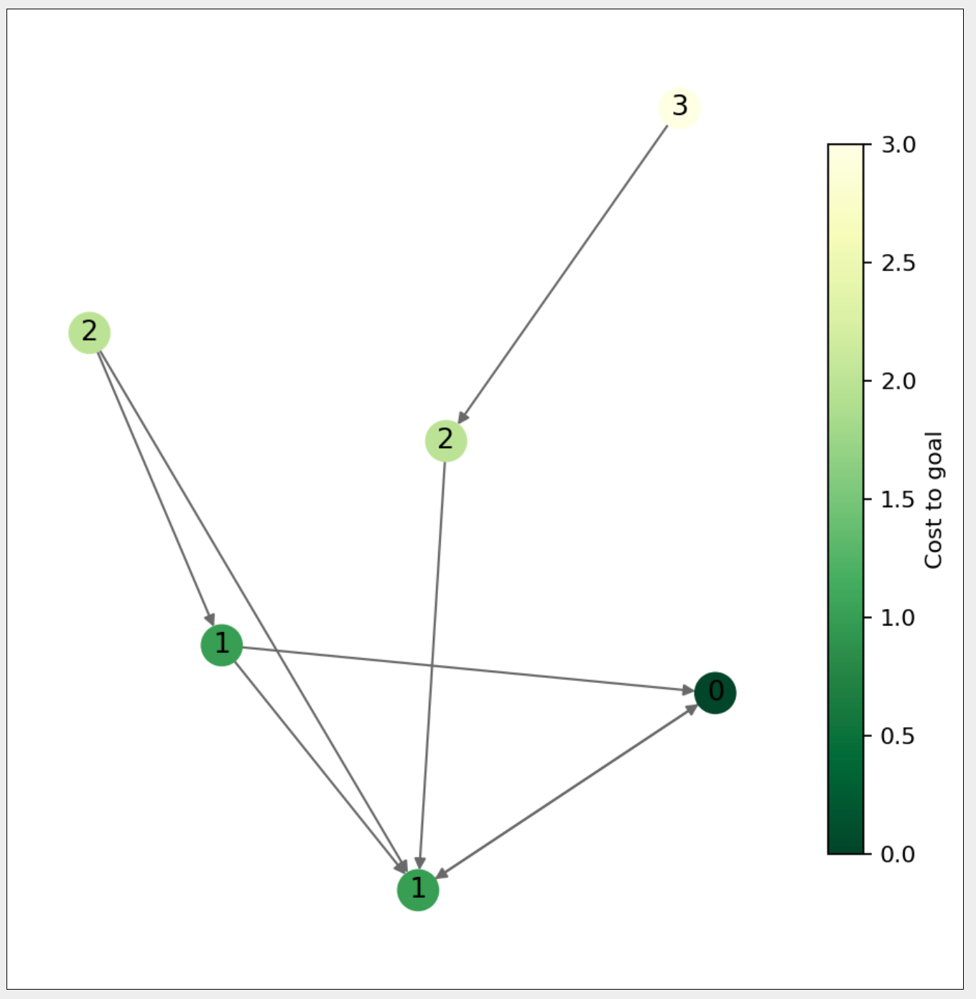
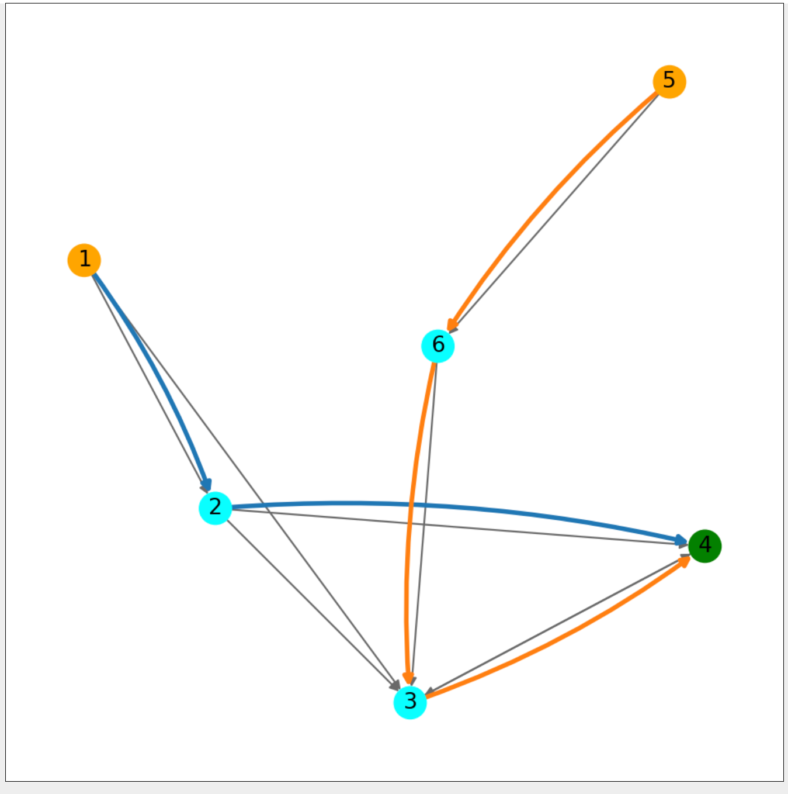
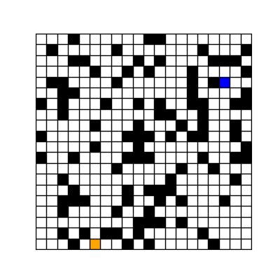
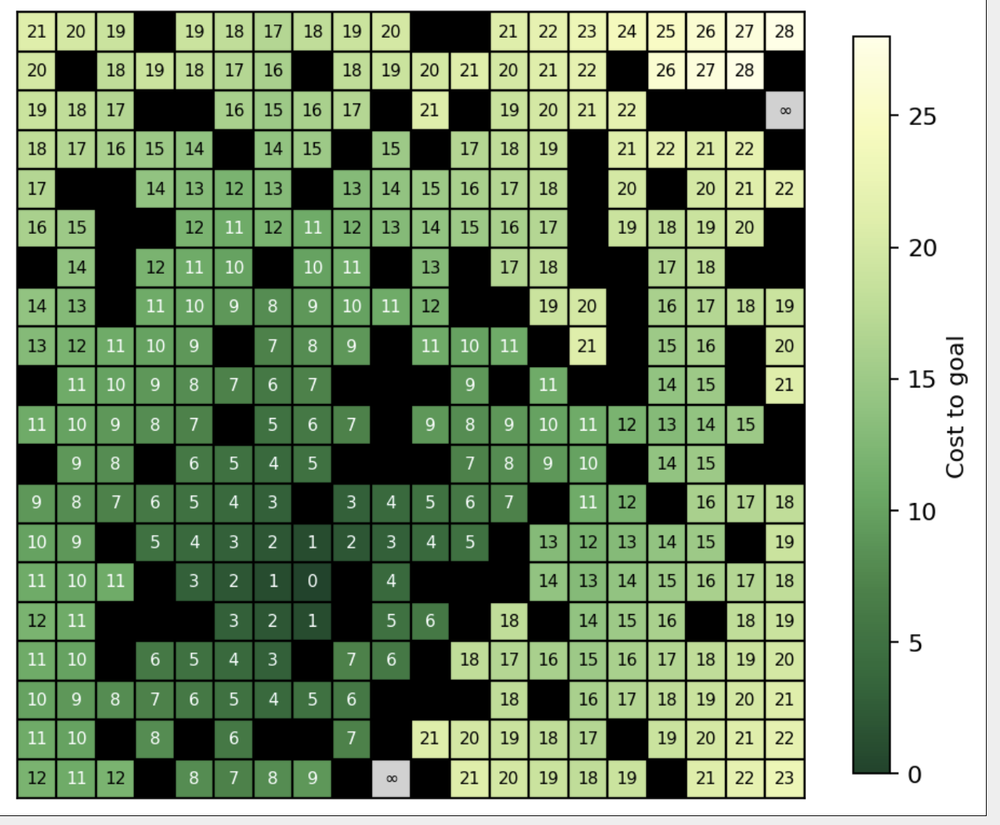

# Graph search :computer:

<table>
  <tr>
    <th><i>Prerequisites:</i></th><td><a href="./00-preliminaries.html" target="_top">Preliminaries</a></td><td><a href="./01-helloworld.html" target="_top">Hello-world</a></td>
  </tr>
</table>

## Breadth/Depth first search

As a first exercise we are going to implement Breadth and Depth First Search. Moreover, we are going to see Wavefront Planning and Iterative Deepening as practical variants of the algorithms.

#### Graph structures

In this exercise we represent a directed graph via an *adjacency list*. Note that this is not the only possible representation (e.g. adjacency matrices,...) but it is a very convenient one for graph search problems if the graph is known a priori.

Given a generic type `X` for the nodes we associate to each node the list of successors, thus:

```python
AdjacencyList = Mapping[X, Set[X]]
```

#### Task

The first part of the task is to implement the _abstractmethod_ `search` for the different search techniques (`exercises/ex02/algo.py`). Given a graph, a starting node, and a goal node the task is to return a sequence of states (_transitions_) from start to goal.

```python
@abstractmethod
def search(self, graph: AdjacencyList, start: X, goal: X) -> Tuple[Path, OpenedNodes]:
    """
    :param graph: The given graph as an adjacency list
    :param start: The initial state (i.e. a node)
    :param goal: The goal state (i.e. a node)
    :return: tuple containing:
        1. The path from start to goal as a Sequence of states, [] if a path does not exist
        2. The list of opened nodes from the start until the last opened node
    """
    pass
```

The `search` method has to be implemented for 3 different algorithms: Breadth First Search, Depth First Search and Iterative Deepening. The method should return the Path from start to end node (empty list `[]` if not found) and the opened nodes `OpenedNodes` during the search. More specifically, `OpenedNodes` should contain nodes in the order that they are popped from the search queue. Note: for Iterative Deepening, as the search state is reset at each iteration, `OpenedNodes` should only contain the nodes opened during the last iteration.
When solving the graph search problem, the following conventions should hold:
* Nodes are represented by Integers.
* When a node is expanded, its neighbours are sorted in increasing order (from smaller to larger Int) and then added in block to the queue. Only the neighbours (if not already in the queue) shall be sorted when added and not the nodes already in the queue.
Ex: The current queue is `Q = [0]`, if nodes to be added in DFS fashion are `{2, 1}` then the new queue will be `Q = [1, 2, 0]`. 
If a successor of the expanded node is already in the queue, it should not be added newly. I.e., given `Q = [0]`, with successors `{2, 1, 0}` then the new queue will be `Q = [1, 2, 0]`.

In the second part of the exercise, you will explore Wavefront Planning. Wavefront Planning applies Breadth-First Search (BFS) to a planning problem. Starting from the goal, BFS explores the graph and assigns each node a cost equal to the minimum number of moves required to reach the goal. The resulting cost-to-go map can then be reused to extract shortest paths from multiple starting positions. 

Consider for example a warehouse robot that must reach a fixed drop-off point but may begin at any free location. Instead of performing a separate graph search for every possible starting position, the Wavefront Planner computes the cost-to-go map once and uses it to efficiently generate a path from any start node.
You are asked to implement two additional methods: `compute_cost_to_go` and `extract_path`.

Given the reversed graph and the goal ID, the `compute_cost_to_go` method should return the shortest distance from every node in the original graph to the goal node. Think about why the reversed graph is provided and how it allows a search starting at the goal to compute these distances.

(HINT) Think about what each depth layer of BFS represents and the order in which these layers are explored.

```python
def compute_cost_to_go(self, reverse_graph: AdjacencyList, goal: X) -> DistanceDict:
        """
        :param reverse_graph: The reversed graph as an adjacency list
        :param goal: The goal state (i.e. a node)
        :return: A dictionary having the graph nodes as keys, and the corresponding distances 
                 to the goal as the value (an int if reachable, inf otherwise)  
        """
```
Here is an example of a cost-to-go map for a simple graph problem. You can visualize the result of your own implementation in the report generated when running the code. The value associated with the goal is always 0. 



The `extract_path` method must use the previously computed cost-to-go map and should *not* perform another graph search. Given the start node, it is possible to construct the path by repeatedly selecting a neighboring node whose cost-to-go value is one less than that of the current node, until the goal is reached. 

```python
def extract_path(self, start: X, graph: AdjacencyList, cost_to_go: DistanceDict) -> Path:
    """
    :param start: The initial state (i.e. a node)
    :param graph: The given graph as an adjacency list
    :param cost_to_go: The cost to go from each node to the goal as a dictionary 
    :return: The path from start to goal as a Sequence of states, [] if a path does not exist
    """
```

The `extract_path` function is used for multiple start queries on the same graph. The paths returned by the function can be visualized in the report generated when running the exercise. Here is an example of the returned paths for the cost-to-go map shown above. 



For more information on the Wavefront Planner, here are some references you might want to look at: ([Tufts wavefront planner](https://www.cs.tufts.edu/comp/150IR/labs/wavefront.html)), ([CMU motion-planning lab](https://www.cs.cmu.edu/~16311/f05/labs/lab05/)). The problem definitions in these resources may differ slightly, so follow the specification in this documentation and treat the links as references only.


When solving the problem, the following conventions should hold: 
* The cost-to-go associated to the goal is 0, while the cost associated to an unreachable node is infinity.
* If multiple neighboring nodes have a cost-to-go value exactly one less than the current node, choose the one with the smallest node ID.
* If the start node has infinite cost, no path to the goal exists.

#### Test cases and performance criteria

The algorithms are going to be tested on different graphs, each containing randomly generated queries (start & goal node).
You'll be able to test your algorithms on some test cases with given solution. For the search algorithms (DFS, BFS, IterativeDeepening) both the `Path` and `OpenedNodes` will be compared to the solution. For the Wavefront Planner the `DistanceDict` and the extracted `Path` will be compared to the solution. 
After running the exercise, you'll find reports in `out/[exercise]/` for each test case. There you'll be able to visualize the graphs, your output and the solution. For the Wavefront Planner, queries with the same goal are grouped together, and their paths from different starting nodes are visualized on a single graph. These test cases aren't graded but serve as a guideline for how the exercise will be graded overall.

The first set of local tests are graph search problems designed to check whether your code handles basic edge cases correctly. Later tests take the form of grid search problems. A grid can be interpreted as a graph, where each square is a node connected to its adjacent squares with those directly above, below, left, or right as neighbors.

This means a grid search problem can be transformed into a standard graph search problem using an adjacency list. This transformation has already been done for you; the grid is simply used to provide a more intuitive visual representation of how the algorithms operate. 

Note: In the transformation from grid to adjacency mentioned above, squares become nodes numbered according to their position on the grid, starting at 1 in the top-left corner. Numbering proceeds left to right across each row, and then continues row by row from top to bottom, up to n*n (where n is the grid size).


Below is an example of a grid: the start node is shown in orange, the goal in blue, the path in red, the opened nodes in green and the black squares represent obstacles. Movement is restricted to one step at a time, either vertically or horizontally.



The grid representation is particularly interesting for the Wavefront Planner, as it can be intended as an occupancy grid, where the free cells are possible starting positions (or goals), and the occupied ones are obstacles. Below you find an example of a cost-to-go map for a grid problem.




#### develop your own test cases

You may want to test your code on additional local cases. To do so, you can create your own tests by modifying the local test data in the `get_graph_search_problems` function located in `src/pdm4ar/exercises_def/ex02/data.py`. You can either define a custom graph or grid manually, or use the `random_geometric_graph` or `generate_random_grid` functions with a fixed seed to ensure reproducibility. For the Wavefront Planner, two starts are used for each goal whenever enough unused nodes are available. This demonstrates the main advantage of the algorithm: the cost-to-go map is computed once for a fixed goal and can then be reused to extract paths from multiple starting positions without running a new graph search for each one. If only one start is specified and an unused node is available, an additional start is selected reproducibly using the random seed configured in `get_wavefront_problems`.

```python
# test graph 1
easy01_id = "easy01"
easy01: AdjacencyList = {1: {2, 3}, 2: {3, 4}, 3: {4}, 4: {3}, 5: {6}, 6: {3}}
easy01_queries = {(1, 4), (2, 6), (6, 1), (6, 6), (5, 4)}
graphsearch_prob.append(GraphSearchProblem(graph=easy01, queries=easy01_queries, graph_id=easy01_id))

# test graph 2
size_g2 = 10
graph02_id = "graph02"
graph02_nx = random_geometric_graph(size_g2, 0.5, seed=9)
graph02: AdjacencyList = networkx_2_adjacencylist(graph02_nx)
graph02_queries = queries_from_adjacency(graph02, 3, n_seed)
graphsearch_prob.append(GraphSearchProblem(graph=graph02, queries=graph02_queries, graph_id=graph02_id))

# test grid 1
grid_id = "grid01"
grid01: Grid = [[1, 1, 0, 0], [0, 1, 0, 0], [0, 0, 0, 1], [0, 1, 0, 0]]
grid01_queries = {(5, 16), (4, 5), (10, 3)}
graphsearch_prob.append(GridSearchProblem(graph=grid_to_adjacency_list(grid01), grid=grid01, queries=grid01_queries, graph_id=grid_id))

# test grid 2
grid_id = "grid02"
grid02: Grid = generate_random_grid(20, 0.25, seed=3)
grid02_queries = generate_queries_grid(grid02, 3, seed=n_seed)
graphsearch_prob.append(GridSearchProblem(graph=grid_to_adjacency_list(grid02), grid=grid02, queries=grid02_queries, graph_id=grid_id))
```

If you add or remove local test cases, don’t forget to update the ex2_get_expected_results function accordingly. Specifically, if you're adding a custom test for debugging purposes, it’s recommended to insert an empty list as a placeholder for its expected results. For example, for the graph search problems, if you add a new test case with one query at the end, you should append an empty list to the returned structure. For Wavefront, replace `custom_queries` with the query-set variable used by the custom problem. This creates all goal and start keys required by the evaluator.

```python
# custom test dfs
expected_results[16] = [([], [])]
# custom test bfs
expected_results[17] = [([], [])]
# custom test id
expected_results[18] = [([], [])]
# custom test Wavefront Planner
expected_results[19] = {
    goal: (
        {},
        {start: [] for start, query_goal in custom_queries if query_goal == goal},
    )
    for goal in {goal for _, goal in custom_queries}
}
```

### final evaluation

The final evaluation combines three metrics lexicographically: <number of solved test cases, accuracy, time>.

* **Accuracy for DFS, BFS, and Iterative Deepening:** Path correctness is 1 if the complete returned `Path` exactly matches the expected path, and 0 otherwise. Opened-nodes correctness is defined in the same way for `OpenedNodes`. Each query is scored as:

  **Query score = 50% path correctness + 50% opened-nodes correctness.**

* **Accuracy for the Wavefront Planner:** For each goal, path accuracy is the number of exactly correct extracted paths divided by the number of associated start nodes. The complete cost-to-go map is considered correct only when the returned `DistanceDict` exactly matches the expected dictionary. Each goal is scored as:

  **Goal score = 50% cost-to-go map correctness + 50% path accuracy.**

Scores are averaged within each graph or grid problem and then across problems. Accuracy is therefore in the interval [0, 1].

* **Solve time:** As your algorithms will be tested on graphs of increasing size, the efficiency of your code will be measured in terms of process time required.

For reference, the TA’s solution achieves the following average solving times on the private test cases:

| Algorithm           | Solving time[s] |
|---------------------|-----------------|
| DepthFirst          | 0.000485        |
| BreadthFirst        | 0.000239        |
| IterativeDeepening  | 0.000867        |

Use these numbers as a guideline to understand the order of magnitude of expected performance for a decently optimized solution.

Keep in mind:
- These times are for reference only, your implementation does not need to match them exactly.
- Small variations in solving time between runs of the same algorithm may be observed.

#### Food for thought

* Which of the graph search algorithms you implemented are better suited for different topologies of graphs?
* Does the presence of cycles in the graph affects any of the algorithms? If yes, why? Which modifications would you do to improve?
* Are the paths that you found the _shortest_ path?
* When running Depth-First Search (DFS) with a depth limit `k`, does the algorithm always explore all nodes at depth `k`?