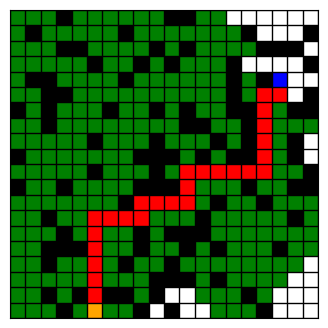

# Graph search :computer:

<table>
  <tr>
    <th><i>Prerequisites:</i></th><td><a href="./00-preliminaries.html" target="_top">Preliminaries</a></td><td><a href="./01-helloworld.html" target="_top">Hello-world</a></td>
  </tr>
</table>

## Breadth/Depth first search

As a first exercise we are going to implement Breadth/Depth first search and Iterative Deepening.

#### Graph structures

In this exercise we represent a directed graph via an *adjacency list*. Note that this is not the only possible
representation (e.g. adjacency matrices,...) but it is a very convenient one for graph search problems if the graph is
known a priori.

Given a generic type `X` for the nodes we associate to each node the list of successors, thus:

```python
AdjacencyList = Mapping[X, Set[X]]
```

#### Task

The task is to implement the _abstractmethod_ `search` for the different search techniques (`exercises/ex02/algo.py`).
Given a graph, a starting node, and a goal node the task is to return a sequence of states (_transitions_) from start to
goal.

```python
@abstractmethod
def search(self, graph: AdjacencyList, start: X, goal: X) -> Tuple[Path, OpenedNodes]:
    """
    :param graph: The given graph as an adjacency list
    :param start: The initial state (i.e. a node)
    :param goal: The goal state (i.e. a node)
    :return: tuple containing:
        1. The path from start to goal as a Sequence of states, [] if a path does not exist
        2. The list of opened nodes from the start until the last opened node
    """
    pass
```

The `search` method has to be implemented for 3 different algorithms: Breadth First Search, Depth First Search and Iterative Deepening. The method should return the Path from start to end node (empty list `[]` if not found) and the opened nodes `OpenedNodes` during the search. More specifically, `OpenedNodes` should contain nodes in the order that they are popped from the search queue. Note: for Iterative Deepening, as the search state is reset at each iteration, `OpenedNodes` should only contain the nodes opened during the last iteration.
When solving the graph search problem, the following conventions should hold:
* Nodes are represented by Integers.
* When a node is expanded, its neighbours are sorted in increasing order (from smaller to larger Int) and then added in block to the queue. Only the neighbours (if not already in the queue) shall be sorted when added and not the nodes already in the queue.
Ex: The current queue is `Q = [0]`, if nodes to be added in DFS fashion are `{2, 1}` then the new queue will be `Q = [1, 2, 0]`. 
If a successor of the expanded node is already in the queue, it should not be added newly. I.e., given `Q = [0]`, with successors `{2, 1, 0}` then the new queue will be `Q = [1, 2, 0]`.

#### Test cases and performance criteria

The algorithms are going to be tested on different graphs, each containing randomly generated queries (start &
goal node).
You'll be able to test your algorithms on some test cases with given solution, both the `Path` and `OpenedNodes` will be compared to the solution. 
After running the exercise, you'll find reports in `out/[exercise]/` for each test case. There you'll be able to visualize the graphs, your output and the solution.These test cases aren't graded but serve as a guideline for how the exercise will be graded overall.

The first set of local tests are graph search problems designed to check whether your code handles basic edge cases correctly. Later tests take the form of grid search problems. A grid can be interpreted as a graph, where each square is a node connected to its adjacent squares with those directly above, below, left, or right as neighbors.

This means a grid search problem can be transformed into a standard graph search problem using an adjacency list. This transformation has already been done for you; the grid is simply used to provide a more intuitive visual representation of how the algorithms operate. 

Note: In the transformation from grid to adjacency mentioned above, squares become nodes numbered according to their position on the grid, starting at 1 in the top-left corner. Numbering proceeds left to right across each row, and then continues row by row from top to bottom, up to n*n (where n is the grid size).


Below is an example of a grid: the start node is shown in orange, the goal in blue, the path in red, the opened nodes in green and the black squares represent obstacles. Movement is restricted to one step at a time, either vertically or horizontally.




#### develop your own test cases

You may want to test your code on additional local cases. To do so, you can create your own tests by modifying the local test data in the `get_graph_search_problems` function located in `src/pdm4ar/exercises_def/ex02/data.py`. You can either define a custom graph or grid manually, or use the `random_geometric_graph` or `generate_random_grid` functions with a fixed seed to ensure reproducibility.

```python
# test graph 1
easy01_id = "easy01"
easy01: AdjacencyList = {1: {2, 3}, 2: {3, 4}, 3: {4}, 4: {3}, 5: {6}, 6: {3}}
easy01_queries = {(1, 4), (2, 6), (6, 1), (6, 6), (5, 4)}
graphsearch_prob.append(GraphSearchProblem(graph=easy01, queries=easy01_queries, graph_id=easy01_id))

# test graph 2
size_g2 = 10
graph02_id = "graph02"
graph02_nx = random_geometric_graph(size_g2, 0.5, seed=9)
graph02: AdjacencyList = networkx_2_adjacencylist(graph02_nx)
graph02_queries = queries_from_adjacency(graph02, 3, n_seed)
graphsearch_prob.append(GraphSearchProblem(graph=graph02, queries=graph02_queries, graph_id=graph02_id))

# test grid 1
grid_id = "grid01"
grid01: Grid = [[1, 1, 0, 0], [0, 1, 0, 0], [0, 0, 0, 1], [0, 1, 0, 0]]
grid01_queries = {(5, 16), (4, 5), (10, 3)}
graphsearch_prob.append(GridSearchProblem(graph=None, grid=grid01, queries=grid01_queries, graph_id=grid_id))

# test grid 2
grid_id = "grid02"
grid02: Grid = generate_random_grid(20, 0.25, seed=3)
grid02_queries = generate_queries_grid(grid02, 3, seed=n_seed)
graphsearch_prob.append(GridSearchProblem(graph=None, grid=grid02, queries=grid02_queries, graph_id=grid_id))
```

If you add or remove local test cases, don’t forget to update the ex2_get_expected_results function accordingly. Specifically, if you're adding a custom test for debugging purposes, it’s recommended to insert an empty list as a placeholder for its expected results. For example, if you add a new test case with one query at the end, you should append an empty list to the returned structure.

```python
# custom test dfs
expected_results[12] = [([], [])]
# custom test bfs
expected_results[13] = [([], [])]
# custom test id
expected_results[14] = [([], [])]
```

### final evaluation

The final evaluation will combine 3 metrics lexicographically <number of solved test cases, accuracy, time>:
* **Accuracy**: The problem has been formulated to allow for 1 unique solution to both `Path` and `OpenedNodes`. 
A `Path`/`OpenedNodes` to be considered correct has to **fully** match the correct solution.
Averaging over the test cases we compute an accuracy metric as (# of correct paths)/(# of paths).Thus, accuracy will be in the interval [0, 1].
* **Solve time**: As your algorithms will be tested on graphs of increasing size, the efficiency of your code will be measured in terms of process time required.

For reference, the TA’s solution achieves the following average solving times on the private test cases:

| Algorithm           | Solving time[s] |
|---------------------|-----------------|
| DepthFirst          | 0.000485        |
| BreadthFirst        | 0.000239        |
| IterativeDeepening  | 0.000867        |

Use these numbers as a guideline to understand the order of magnitude of expected performance for a decently optimized solution.

Keep in mind:
- These times are for reference only, your implementation does not need to match them exactly.
- Small variations in solving time between runs of the same algorithm may be observed.

#### Food for thought

* Which of the graph search algorithms you implemented are better suited for different topologies of graphs?
* Does the presence of cycles in the graph affects any of the algorithms? If yes, why? Which modifications would you do to improve?
* Are the paths that you found the _shortest_ path?
* When running Depth-First Search (DFS) with a depth limit `k`, does the algorithm always explore all nodes at depth `k`?