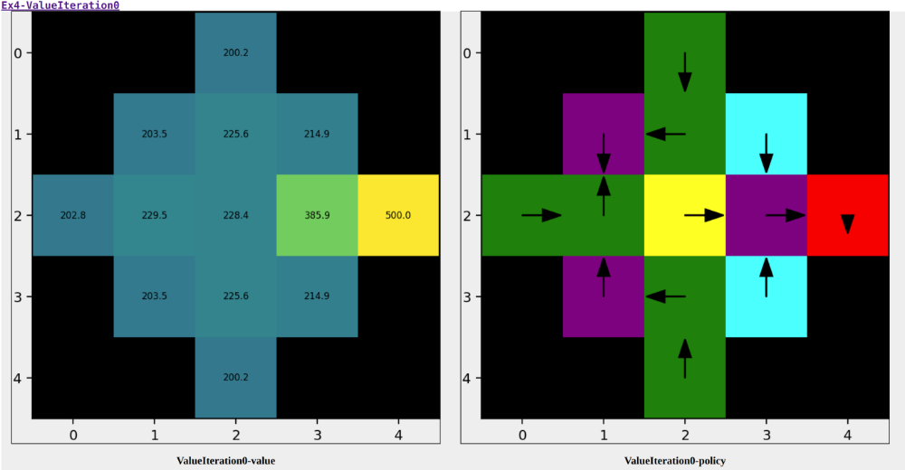

# Dynamic Programming :computer:

| _Prerequisites_:    | [Preliminaries](00-preliminaries.md) | [Hello-world](01-helloworld.md)|

In this exercise you will implement _Value_ and _Policy iterations_ to solve a particular stationary Markov
Decision Process (MDP).

You are an operator on a distant planet at a base responsible for deploying autonomous survey robots looking for unobtainium. Your job is to send a surveying robot to a location specified by your company's client.

For each contract, you can deploy several robots, but only one at a time - corporate requires you to have at most one active robot in the field at any given time to try to save money.
You can always choose to abandon an active robot and deploy a new one from the base.
In some cases, an active robot might break down - then, you are forced to abandon it.
However, deploying the second and every next robot for a contract costs you money (the first robot is covered by the client).

Once a robot reaches the goal location, it stays there and delivers data reports to the client, thus fulfilling the contract.
For this, you receive a reward from the client.
Your robot should reach the goal location as fast as possible since the client is entitled to compensation for the time it takes you to fulfill the contract.

Your task is to create a plan for each given contract that maximizes your profit.
You choose to model this problem as a Markov Decision Process (MDP) and use dynamic programming to compute offline the optimal policy for each mission.

## Problem description

The world is modeled as a 2D grid, which is represented through a _MxN_ matrix (numpy array).
Rows and columns represent the $i$ and $j$ coordinates of the robot, respectively.
The area around you is a tropical rainforest, which can be modeled in the grid with the following types of cells:
- ``GRASS`` (green) - it will take the robot 1 hour to cross this cell.
- ``SWAMP`` (light blue) - it will take the robot 2 hours to cross this cell.
- ``WONDERLAND`` (purple) - it is a random cell and can be considered a ``GRASS`` cell. In addition, when the robot moves to a wonderland, it will be teleported instantly (without any time cost) to one of the adjacent cells, excluded the one where the robot was before the move. Moreover, there are never 2 close cells that are both ``WONDERLAND``. This means that if, given 2 cells $(i_1, j_1)$ and $(i_2, j_2)$, $\sqrt{(i_2 - i_1)^2 + (j_2 - j_1)^2} \leq \sqrt{2}$, the 2 cells can't be both ``WONDERLAND``.
- ``CLIFF`` (black) - untraversable cell. If the robot tries to move in this cell, it will break down and you will need to deploy a new robot from the base.
- ``GOAL`` (red) - the goal location you need to survey.
- ``START`` (yellow) - the location of your base, it can be considered a ``GRASS`` cell. The 8 cells close to the ``START`` cell are always ``GRASS`` or ``GOAL`` cells, except for the 4 in the corners that could also be ``SWAMP``, and there are at least 2 cells between the ``START`` cell and the edge of the map or a ``CLIFF`` cell. In other word, the robot will never break down in the ``START`` cell and the four neighboring cells. Moreover ``WONDERLAND`` cells are always at least 3 cells away from the ``START`` cell in a single direction. This means that if, given the ``START`` cell $(i_1, j_1)$ and a ``WONDERLAND`` cell $(i_2, j_2)$ such that $i_1 = i_2$ or $j_1 = j_2$, it should be $\sqrt{(i_2 - i_1)^2 + (j_2 - j_1)^2} > 2$.


The time required to cross each cell corresponds to the time a robot needs to leave this cell (e.g. leaving the ``START`` cell takes 1 hour).
When in a specific cell, you can plan for the robot to take one of the following actions:
- move in a selected direction: ``SOUTH, NORTH, EAST, WEST``
- give up and ``ABANDON`` its mission (this implies the deployment of a new robot from the base),
- ``STAY`` if arrived at the ``GOAL``.

The goal of your policy is to maximize profit (use 1k USD as the default unit):
- You keep receiving a bonus of 50k USD for your robot surveying(staying at) the goal location.
- For each hour of the time it takes you to fulfill the contract, your client is entitled to a compensation of 1k USD. No compensation is paid if the robot is already at the goal location.
- The deployment of each new robot costs you 10k USD (the first robot is covered by the client).
- You get a positive reward of 3k USD if you pass through a ``WONDERLAND`` only if it does not move you to a ``CLIFF`` cell (if you pass through a ``WONDERLAND`` but you end in a ``CLIFF``, it will only cost you 10k USD to build a new robot without any reward).


The planet's atmosphere is very foggy and when the robot decides to move in a specific direction, it may not end up where initially planned. Sometimes, when trying to move, it might also break down and be forced to abandon its mission. In fact, for all transitions, the following probabilities are given:
- In ``GRASS``:
  - If the robot chooses to move (``SOUTH, NORTH, EAST, WEST``), the chosen transition will happen with a probability of 0.75. The remaining 0.25 is split among the other 3 movement transitions. The robot will not break down in this cell.
  - If the robot chooses to give up, it will ``ABANDON`` its mission with probability 1.0.
- In ``SWAMP``:
  - Because it is harder to move, if the robot chooses to move (``SOUTH, NORTH, EAST, WEST``), the chosen transition will happen with a probability of 0.5.
  With probability 0.25, the robot will move to one of the other neighboring cells (with all of them equally likely).
  With probability 0.2, the robot will not be able to move out of the cell (it will stay in the cell).
  With probability 0.05 the robot will break down and will need to ``ABANDON`` its mission.
  - If the robot chooses to give up, it will ``ABANDON`` its mission with probability 1.0.
- In ``WONDERLAND``:
  - The robot will be teleported instantly to one of the adjacent cells, excluded the one where the robot was before the move, with equal probability. 
  - The robot will not break down during teleportation, unless it ends up in a cliff or outside the map.
- In ``CLIFF``:
  - The robot will break down with probability 1.0.
- When in the ``GOAL`` the robot will ``STAY``  with probability of 1.0.
- The robot cannot directly pick an action that would take it outside the map or to a ``CLIFF`` cell. However, it may be that the robot ends up out of the map or in a ``CLIFF`` cell as described by the movement transition probabilities above. If this happens, the robot breaks down.

If the robot breaks down or chooses to ``ABANDON`` the mission, a new robot is deployed in the ``START`` cell, which costs you 10k USD.

### Hints
- You can model the ``ABANDON`` action transition as a transition in your MDP from the current cell to the ``START`` cell with the cost of deploying a new robot.
- You can model the teleportation as a transition in your MDP from the current cell to one close to the ``WONDERLAND`` cell with a probability $P(x_{k+1} \mid x_k, u_k)=P(x_{k+1} \mid x^-)P(x^- \mid x_k, u_k)$, where $x^-$ is the state of the adjacent ``WONDERLAND`` after applying the action $u_k$ in the current state $x_k$, $x_{k+1}$ is the state after the teleportation. As the teleportation is instantaneous, you can model __moving to the adjacent ``WONDERLAND``__ and then __being teleported to the next state__ as a single transition.
- If the robot chooses a movement action in any cell, it will take it the time specified for this cell type to try to perform this action. An attempt to move out of the ``SWAMP`` cell always takes 2 hours, even if the robot ends up staying in the cell or breaking down.
- If the robot passes through a ``WONDERLAND``, you need to consider both the reward given by the ``WONDERLAND`` and the cost to move from the current cell.
- Note that the robot will never break down in the ``START`` cell or in its four neighboring cells because of the assumptions on their type and location on the map.

## Tasks

### Data structure

Actions, states, Value function and Policy are defined as follows (exercises/ex04/structures.py):

```python
from enum import IntEnum, unique
from typing import Union

import numpy as np
from numpy.typing import NDArray


@unique
class Action(IntEnum):
    NORTH = 0
    WEST = 1
    SOUTH = 2
    EAST = 3
    STAY = 4
    ABANDON = 5


State = tuple[int, int]
"""The state on a grid is simply a tuple of two ints"""


@unique
class Cell(IntEnum):
    GOAL = 0
    START = 1
    GRASS = 2
    SWAMP = 3
    WONDERLAND = 4
    CLIFF = 5


Policy = NDArray[np.int64]
"""Type Alias for the policy.It is the expected type of the policy that your solution should return."""
OptimalActions = NDArray[np.object_]
"""
Type Alias for the all optimal actions per state. It is a numpy array of list objects where each list contains the
optimal actions that are equally good for a given state. It is the type of the ground truth policy that your
solution will be compared against. You are not required to use this type in your solution.
"""
ValueFunc = NDArray[np.float64]
"""Type Alias for the value function. It is the expected type of the value function that your solution should return."""
```

The first subtask is to implement the missing methods in `exercises/ex04/mdp.py`.
These methods will be useful when implementing value and policy iteration.

```python
class GridMdp:
    def __init__(self, grid: NDArray[np.int], gamma: float = 0.9):
        assert len(grid.shape) == 2, "Map is invalid"
        self.grid = grid
        """The map"""
        self.gamma: float = gamma
        """Discount factor"""

    def get_transition_prob(self, state: State, action: Action, next_state: State) -> float:
        """Returns P(next_state | state, action)"""
        # todo

    def stage_reward(self, state: State, action: Action, next_state: State) -> float:
        # todo
```

Feel free to add more methods in case you need to.
The method ``get_transition_prob`` returns the probability of transitioning from a state to another given an action - you must not change the name and signature of this function! 
The method ``stage_reward``returns the reward that corresponds to transitioning from the current state to the next after choosing the given action.

#### Value Iteration

We'll start with value iteration. You need to implement the following methods in ``exercises/ex04/value_iteration.py``:

```python
class ValueIteration(GridMdpSolver):
    @staticmethod
    @time_function
    def solve(grid_mdp: GridMdp) -> Tuple[ValueFunc, Policy]:
        value_func = np.zeros_like(grid_mdp.grid).astype(float)
        policy = np.zeros_like(grid_mdp.grid).astype(int)

        # todo implement here

        return value_func, policy
```

#### Policy iteration

For policy iteration, you need to implement the following methods in ``exercises/ex04/policy_iteration.py``:

```python
class PolicyIteration(GridMdpSolver):

    @staticmethod
    @time_function
    def solve(grid_mdp: GridMdp) -> Tuple[ValueFunc, Policy]:
        value_func = np.zeros_like(grid_mdp.grid).astype(float)
        policy = np.zeros_like(grid_mdp.grid).astype(int)

        # todo implement here

        return value_func, policy
```

#### Expected outcome

For both _Value_ and _Policy iterations_, you need to return the optimal `ValueFunc` and **one of the optimal `Policy`** for the given MDP.

> **Note**: The optimal value function is unique, but the optimal policy is not. You can return any optimal policy that satisfies the Bellman optimality equation.

To keep the format consistent, the value function and policy should be returned as _MxN_ matrices (numpy arrays) where each cell corresponds to the value of the state or the action to be taken in the state, respectively. The value function and policy of `CLIFF` and `WONDERLAND` cells will be excluded for evaluation. This is because you are never in `CLIFF` and you can only pass from `WONDERLAND` without choosing any action.

If your algorithm works, in the report you should find some results similar to this:

{: #example-picture}


<span style="text-align: center; display: block;">
Figure 1: Visualization of the optimal value function and policy for a 5x5 example.
</span>


On the left the Value function is visualized as a heatmap.
On the right you can see the map with the original cells and the corresponding optimal policy (arrows for movement actions, X for the ``ABANDON`` action).
In both the images, the `WONDERLAND` cells are purple cell because we can't attribute a value or a policy considering that we don't have any control when we are there. For this reason in the Policy plot there is a circle where there are `WONDERLAND` cells.

### Help for modeling the MDP

Correctly modeling the MDP is crucial for the success of your algorithms. To help you with this, we provide you with the admissible action set, the ground truth transition probabilities and rewards for selected cells of the [5x5 example](#example-picture) above. You can use these to validate your implementation. Moreover, the function `get_transition_prob()` is evaluated on sampled state-action pairs to help you understanding if this crucial part is correctly implemented. You can also modify the test cases to check for edge cases for the transition probabilities in the function `get_transition_prob_test_cases()`. You can find it directly in the file `data.py`.

The coordinates of the cells are given in the format `(row, column)` starting from the top left corner of the grid. All axes are 0-indexed.

#### Admissible action set

> **Note**: The admissible action set is only given for a selection of states.

```<current state>: [list of admissible actions]```

```
- (0, 1): [SOUTH, EAST, ABANDON]  
- (1, 2): [WEST, EAST, NORTH, SOUTH, ABANDON]
- (2, 0): [EAST, NORTH, SOUTH, ABANDON]
- (4, 3): [WEST, NORTH, ABANDON]
```

#### Ground truth transition probabilities and rewards

> **Note**: The ground truths are only given for a selection of state-action pairs.

```(<current state>, <action>): (<next state>, <probability>, <reward>)```

```
- ((0, 1), SOUTH):   ((1, 1), 0.75, -1), ((2, 2), 0.1667, -11), ((0,2), 0.0833, -1)
- ((0, 1), ABANDON): ((2, 2), 1.0, -10)
- ((1, 2), WEST):    ((1, 1), 0.75, -1), ((0, 2), 0.0833, -1), ((2, 2), 0.0833, -1), ((1, 3), 0.0833, -1)
- ((2, 0), SOUTH):   ((2, 1), 0.0833, -1), ((1, 1), 0.0278, 2), ((3, 1), 0.25, 2), ((2, 2), 0.6389, -11)
- ((3, 3), WEST):    ((3, 2), 0.5, -2), ((4, 3), 0.0833, -2), ((2, 4), 0.0278, 1), ((2, 3), 0.0833, -2) ((2, 2), 0.1055, -12), ((3, 3), 0.2, -2)
```


### Test cases and performance criteria

The algorithms are going to be tested on different MDPs, each containing randomly located queries (start & goal cells).
You will be able to test your algorithms on some test cases with given solution, the outputted `Policy` and `ValueFunc` will be compared to the solution. 
After running the exercise, you will find the reports in `out/04/` for each test case. 
There you will be able to visualize the MDPs, your output and the expected solution.
These test cases are not graded but serve as a guideline for how the exercise will be graded overall.

The final evaluation will combine the following metrics: ratio of completed cases, transition_prob_accuracy, average policy_accuracy, average value_func_R2, and average solve_time:
* **ratio of completed cases**: $\frac{N_{completed}}{N}$
* **transition_prob_accuracy**: This metric will evaluate the accuracy of your transition probability, in particular, for different cases (state, action, next_state), it considers 1.0 if the probability is equal (up to numerical errors) to the ground truth, 0.0 otherwise. Then it averages the results.
* **policy_accuracy**: This metric will evaluate the accuracy of your `Policy`, in particular, it averages for each state of the MDP the number of correct actions (# of correct actions)/(# of states). Thus, policy_accuracy will be in the interval [0, 1].
* **value_func_R2**: This metric will evaluate the accuracy of your `ValueFunc`. It is a measure of how well your `ValueFunc` approximates the ground truth `ValueFunc`. It is computed as $R^2 = 1 - \frac{\sum_{s \in S} (VF^{gt}(s) - VF(s))^2}{\sum_{s \in S} (VF^{gt}(s) - \bar{VF^{gt}})^2}$ where $VF^{gt}$ is the ground truth `ValueFunc`, $VF$ is your `ValueFunc`, and $\bar{VF^{gt}}$ is the mean of the ground truth `ValueFunc`. With negative values being clipped to 0, this metric will be in the interval [0, 1].
* **solve_time**: As your algorithms will be tested on graphs of increasing size, the efficiency of your code will be measured in terms of process time required (in seconds).

<!-- The final score will be computed as follows: $score = \frac{N_{completed}}{N} \cdot \left((\frac{policy\_accuracy + value\_func\_R2}{2} - 0.0025 \cdot solve\_time) * 0.8 + transition\_prob\_accuracy * 0.2\right)$

In the report you will find the average of each metric for all the test cases (`perf_result`), value iteration test cases (`value_iteration`), policy iteration test cases (`policy_iteration`) and transition probability test cases (`transition_prob`).
The score is calculated based on all the test cases (`perf_result`) plus (`transition_prob`). -->

<!-- For reference, the TA’s solution achieves the following efficiency and solving times on the server:

| Metric              | Values      | PASSING  | GOOD   |
|---------------------|-------------|----------|--------|
| Score               | [0, 1.0)    | >0.9     | >0.99  | -->

Solving time reference: 

| Algorithm           | Solving time[s] |
|---------------------|-----------------|
| ValueIteration      | 8.714           |
| PolicyIteration     | 4.263           |