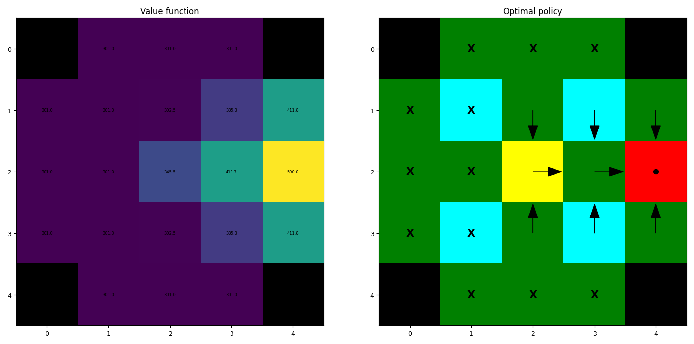

# Dynamic Programming :computer:

| _Prerequisites_:    | [Preliminaries](00-preliminaries.md) | [Hello-world](01-helloworld.md)|

In this exercise you will implement _Value_ and _Policy iterations_ to solve Markov
Decision Processes (MDPs). The exercise has two parts. In **Part 1** you model a grid-world
problem as an MDP and solve it. In **Part 2** the world changes in three small ways, and each
change quietly breaks the Markov property of the grid: knowing the robot's cell is no longer
enough to predict its future. Your job, for each case, is to figure out what the state needs
to remember, turn the problem back into an MDP, and solve it with the very same Value and
Policy Iteration you wrote for Part 1.

You are an operator on a distant planet at a base responsible for deploying autonomous survey
robots looking for unobtainium. Your job is to send a surveying robot to a location specified
by your company's client.

For each contract, you can deploy several robots, but only one at a time - corporate requires
you to have at most one active robot in the field at any given time to try to save money.
You can always choose to abandon an active robot and deploy a new one from the base.
In some cases, an active robot might break down - then, you are forced to abandon it.
However, deploying the second and every next robot for a contract costs you money (the first
robot is covered by the client).

Once a robot reaches the goal location, it stays there and delivers data reports to the
client, thus fulfilling the contract. For this, you receive a reward from the client.
Your robot should reach the goal location as fast as possible since the client is entitled
to compensation for the time it takes you to fulfill the contract.

Your task is to create a plan for each given contract that maximizes your profit.
You choose to model this problem as a Markov Decision Process (MDP) and use dynamic
programming to compute offline the optimal policy for each mission.

## Part 1: the base problem

The world is modeled as a 2D grid, which is represented through a _MxN_ matrix (numpy array).
Rows and columns represent the $i$ and $j$ coordinates of the robot, respectively.
The area around you is a tropical rainforest, which can be modeled in the grid with the
following types of cells:
- ``GRASS`` (green) - it will take the robot 1 hour to cross this cell.
- ``SWAMP`` (light blue) - it will take the robot 2 hours to cross this cell.
- ``CLIFF`` (black) - untraversable cell. If the robot tries to move in this cell, it will
  break down and you will need to deploy a new robot from the base.
- ``GOAL`` (red) - the goal location you need to survey.
- ``START`` (yellow) - the location of your base, it can be considered a ``GRASS`` cell.
  The 8 cells close to the ``START`` cell are always ``GRASS`` or ``GOAL`` cells, except for
  the 4 in the corners that could also be ``SWAMP``, and there are at least 2 cells between
  the ``START`` cell and the edge of the map or a ``CLIFF`` cell. In other words, the robot
  will never break down in the ``START`` cell and the four neighboring cells.

The time required to cross each cell corresponds to the time a robot needs to leave this cell
(e.g. leaving the ``START`` cell takes 1 hour).
When in a specific cell, you can plan for the robot to take one of the following actions:
- move in a selected direction: ``SOUTH, NORTH, EAST, WEST``
- give up and ``ABANDON`` its mission (this implies the deployment of a new robot from the
  base),
- ``STAY`` if arrived at the ``GOAL``.

The goal of your policy is to maximize profit (use 1k USD as the default unit):
- You keep receiving a bonus of 50k USD for your robot surveying (staying at) the goal
  location.
- For each hour of the time it takes you to fulfill the contract, your client is entitled to
  a compensation of 1k USD. No compensation is paid if the robot is already at the goal
  location.
- The deployment of each new robot costs you 10k USD (the first robot is covered by the
  client).

The planet's atmosphere is very foggy and when the robot decides to move in a specific
direction, it may not end up where initially planned. Sometimes, when trying to move, it
might also break down and be forced to abandon its mission. In fact, for all transitions, the
following probabilities are given:
- In ``GRASS``:
  - If the robot chooses to move (``SOUTH, NORTH, EAST, WEST``), the chosen transition will
    happen with a probability of 0.75. The remaining 0.25 is split among the other 3 movement
    transitions. The robot will not break down in this cell.
  - If the robot chooses to give up, it will ``ABANDON`` its mission with probability 1.0.
- In ``SWAMP``:
  - Because it is harder to move, if the robot chooses to move
    (``SOUTH, NORTH, EAST, WEST``), the chosen transition will happen with a probability of
    0.5. With probability 0.25, the robot will move to one of the other neighboring cells
    (with all of them equally likely). With probability 0.2, the robot will not be able to
    move out of the cell (it will stay in the cell). With probability 0.05 the robot will
    break down and will need to ``ABANDON`` its mission.
  - If the robot chooses to give up, it will ``ABANDON`` its mission with probability 1.0.
- In ``CLIFF``:
  - The robot will break down with probability 1.0.
- When in the ``GOAL`` the robot will ``STAY`` with probability of 1.0.
- The robot cannot directly pick an action that would take it outside the map or to a
  ``CLIFF`` cell. However, it may be that the robot ends up out of the map or in a ``CLIFF``
  cell as described by the movement transition probabilities above. If this happens, the
  robot breaks down.

If the robot breaks down or chooses to ``ABANDON`` the mission, a new robot is deployed in
the ``START`` cell, which costs you 10k USD.

### Hints
- You can model the ``ABANDON`` action transition as a transition in your MDP from the
  current cell to the ``START`` cell with the cost of deploying a new robot.
- If the robot chooses a movement action in any cell, it will take it the time specified for
  this cell type to try to perform this action. An attempt to move out of the ``SWAMP`` cell
  always takes 2 hours, even if the robot ends up staying in the cell or breaking down.
- Note that the robot will never break down in the ``START`` cell or in its four neighboring
  cells because of the assumptions on their type and location on the map.

## Part 2: new states

Everything above still holds. In each of the three cases below, one short story change breaks
the Markov property of the bare grid; you decide what the state must remember to restore it.
The state becomes `(i, j, z)` where `z` is defined per case, and your value function and
policy become arrays of shape `(M, N, Z)`: one grid slice per value of `z`. Each case is
solved and graded separately.

### Case 1: Forecast ("the base radios the fog")

Each hour the base transmits a forecast for the coming hour's fog. Forecasts are independent
across hours, with `P(FOGGY) = 0.3`. The forecast does not change the world; it only tells
you how this hour's move will behave:

| forecast f | GRASS intended / each slip | SWAMP intended / each slip | stay | break |
|---|---|---|---|---|
| CLEAR | 0.75 / 0.25 ÷ 3 (as in Part 1) | 0.50 / 0.25 ÷ 3 | 0.20 | 0.05 |
| FOGGY | 0.55 / 0.15 | 0.30 / 0.15 | 0.20 | 0.05 |

(The forecast's accuracy is already folded into these numbers.) Think carefully about whether
something that changes nothing physical still needs to be part of the state.

### Case 2: Momentum ("the robot keeps rolling")

The robots' wheels carry momentum: slips lean toward wherever the robot moved last hour, and
turning around against your own motion is hard.

Let `h` be the direction the robot **actually moved** last hour, one of
`{-, NORTH, WEST, SOUTH, EAST}`, where `-` means it did not move (it stayed in place, or a
fresh robot was just deployed). When the robot chooses a movement action `u`:

The movement outcomes are: the **intended** direction `u`, a **slip toward `h`** (when it
differs from `u`), and a slip to **each remaining** direction. Depending on how `h` relates
to `u`:

- **`h = -`**: no momentum; exactly the Part-1 distribution.
- **`h = u`**: intended +0.10; the remaining movement mass splits uniformly, 0.05 per other
  direction.
- **`h` opposite of `u`**: intended -0.10; the slip leans backward: 0.25 toward `h`, 0.05
  toward each perpendicular direction.
- **`h` perpendicular to `u`**: intended unchanged; the slip leans sideways: 0.15 toward
  `h`, 0.05 toward each of the other two directions.

For example, on ``GRASS`` this gives:

| last heading h | intended u | slip toward h | each remaining direction |
|---|---|---|---|
| `-` (no momentum) | 0.75 | - | 0.25/3 each (3 directions) |
| h = u (same direction) | 0.85 | - | 0.05 each (3 directions) |
| h opposite of u | 0.65 | 0.25 | 0.05 each (2 directions) |
| h perpendicular to u | 0.75 | 0.15 | 0.05 each (2 directions) |

As in Part 1, a slip that would take the robot off the map or into a ``CLIFF`` cell is a
breakdown (a new robot is deployed at ``START``).

After the hour: `h` becomes the direction the robot **actually moved** - not the one you
commanded. If you command EAST and the robot slips NORTH, next hour `h = NORTH`. If it
stayed in place, or broke down, or you chose `ABANDON` (a fresh robot is deployed at START,
and a fresh robot has no momentum), then `h = -`.

### Case 3: Glitch ("bad wheel days")

The robots' wheels sometimes glitch, and once the glitching starts it tends to last a while.
Let `g in {OK, GLITCHY}` be the current condition of the wheels.

How the robot moves this hour depends on the current `g`:

- **`g = OK`**: exactly the Part-1 distribution.
- **`g = GLITCHY`**: the intended probability drops by 0.15 and the freed mass splits
  uniformly over the other 3 directions (0.05 more per slip). On ``GRASS``: 0.60 intended,
  0.40/3 per slip. On ``SWAMP``: 0.35 intended, 0.40/3 per slip; stay (0.20) and break
  (0.05) are unchanged.

Unlike the forecast, the glitch has memory. At the end of the hour `g` evolves:

- after a normal hour (the robot moved or stayed in place):
  `P(OK -> GLITCHY) = 0.1` and `P(GLITCHY -> OK) = 0.3`;
- after a breakdown or `ABANDON`, a fresh robot is deployed at ``START``, and a fresh robot
  has new wheels: `g = OK` with probability 1, whatever the old robot's wheels were doing.

**Something to think about.** Before writing code for each case, try to answer for yourself:
what is your state, why does the grid alone stop being Markov, and why does your state
restore it? A wrong state choice is much easier to catch in a few sentences than in a
heatmap.

## Tasks

### Data structure

Actions, states, Value function and Policy are defined as follows
(exercises/ex04/structures.py):

```python
@unique
class Action(IntEnum):
    NORTH = 0
    WEST = 1
    SOUTH = 2
    EAST = 3
    STAY = 4
    ABANDON = 5


State = tuple[int, int]
"""The Part-1 state is a tuple of two ints."""


@unique
class Cell(IntEnum):
    GOAL = 0
    START = 1
    GRASS = 2
    SWAMP = 3
    CLIFF = 4


AugmentedState = tuple[int, int, int]
"""The Part-2 state is (i, j, z); z orderings are fixed by these enums:"""


@unique
class Heading(IntEnum):
    NONE = 0; NORTH = 1; WEST = 2; SOUTH = 3; EAST = 4

@unique
class Fog(IntEnum):
    CLEAR = 0; FOGGY = 1

@unique
class Gear(IntEnum):
    OK = 0; GLITCHY = 1


ValueFunc = NDArray[np.float64]   # (M, N) in Part 1, (M, N, Z) in Part 2
Policy = NDArray[np.int64]        # (M, N) in Part 1, (M, N, Z) in Part 2

OptimalActions = NDArray[np.object_]
"""
Type Alias for the all optimal actions per state. It is a numpy array of list objects where
each list contains the optimal actions that are equally good for a given state. It is the
type of the ground truth policy that your solution will be compared against. You are not
required to use this type in your solution.
"""
```

### The MDP models

The first subtask is to implement the missing methods in `exercises/ex04/mdp.py`.
These methods will be useful when implementing value and policy iteration.

For each class you need to fill in `get_transition_prob`, which returns the probability of
transitioning from a state to another given an action, and `stage_reward`, which returns the
reward for that transition. The signatures are identical across all four classes; only the
`State` widens to `AugmentedState` in Part 2:

```python
class GridMdp:
    def __init__(self, grid: NDArray[np.int64], gamma: float = 0.9):
        assert len(grid.shape) == 2, "Map is invalid"
        self.grid = grid
        """The map"""
        self.gamma: float = gamma
        """Discount factor"""

    def get_transition_prob(self, state: State, action: Action, next_state: State) -> float:
        """Returns P(next_state | state, action)"""
        # todo

    def stage_reward(self, state: State, action: Action, next_state: State) -> float:
        # todo


class MomentumGridMdp(AugmentedGridMdp): ...   # Z = 5
class FogGridMdp(AugmentedGridMdp): ...        # Z = 2
class GlitchGridMdp(AugmentedGridMdp): ...     # Z = 2
```

Feel free to add more methods in case you need to.
You must not change the names and signatures of `get_transition_prob` and `stage_reward`.

#### Value Iteration

We'll start with value iteration. You need to implement the `solve` method in
``exercises/ex04/value_iteration.py``:

```python
class ValueIteration(GridMdpSolver):
    @staticmethod
    @time_function
    def solve(grid_mdp: AnyGridMdp) -> tuple[ValueFunc, Policy]:
        # todo implement here
        ...
```

#### Policy iteration

For policy iteration, you need to implement the `solve` method in
``exercises/ex04/policy_iteration.py``:

```python
class PolicyIteration(GridMdpSolver):
    @staticmethod
    @time_function
    def solve(grid_mdp: AnyGridMdp) -> tuple[ValueFunc, Policy]:
        # todo implement here
        ...
```

One solver serves both parts: if you write it to iterate over "the states of the MDP" it runs
on Part 2 unchanged; only the model underneath grows.

#### Expected outcome

For both _Value_ and _Policy iterations_, you need to return the optimal `ValueFunc` and
**one of the optimal `Policy`** for the given MDP.

> **Note**: The optimal value function is unique, but the optimal policy is not. You can
> return any optimal policy that satisfies the Bellman optimality equation; the ground truth
> stores all optimal actions per state, so your tie-breaking never costs you.

To keep the format consistent, the value function and policy should be returned as numpy
arrays where each cell corresponds to the value of the state or the action to be taken in the
state, respectively: _MxN_ matrices in Part 1 and _MxNxZ_ arrays in Part 2. The value
function and policy of `CLIFF` cells will be excluded for evaluation. This is because you are
never in `CLIFF`.

If your algorithm works, in the report you should find some results similar to this:

{: #example-picture}


<span style="text-align: center; display: block;">
Figure 1: Visualization of the optimal value function and policy for the 5x5 example.
</span>

On the left the Value function is visualized as a heatmap.
On the right you can see the map with the original cells and the corresponding optimal policy
(arrows for movement actions, X for the ``ABANDON`` action).

### Help for modeling the MDP

Correctly modeling the MDPs is crucial. For Part 1 we provide the admissible action set and
ground truth transition probabilities and rewards for selected cells of the
[5x5 example](#example-picture) map;
for Part 2, `get_transition_prob` is additionally evaluated on sampled augmented triples.
The coordinates of the cells are given in the format `(row, column)` starting from the top
left corner of the grid. All axes are 0-indexed.

#### Admissible action set (Part 1, 5x5 example)

```<current state>: [list of admissible actions]```

```
- (0, 1): [SOUTH, EAST, ABANDON]
- (1, 2): [NORTH, WEST, SOUTH, EAST, ABANDON]
- (2, 0): [NORTH, SOUTH, EAST, ABANDON]
- (4, 3): [NORTH, WEST, ABANDON]
```

#### Ground truth transition probabilities and rewards (Part 1, 5x5 example)

```(<current state>, <action>): (<next state>, <probability>, <reward>)```

```
- ((0, 1), SOUTH):   ((1, 1), 0.75, -1), ((0, 2), 0.0833, -1), ((2, 2), 0.1667, -11)
- ((0, 1), ABANDON): ((2, 2), 1.0, -10)
- ((1, 2), WEST):    ((1, 1), 0.75, -1), ((0, 2), 0.0833, -1), ((1, 3), 0.0833, -1), ((2, 2), 0.0833, -1)
- ((2, 0), SOUTH):   ((3, 0), 0.75, -1), ((1, 0), 0.0833, -1), ((2, 1), 0.0833, -1), ((2, 2), 0.0833, -11)
- ((3, 3), WEST):    ((3, 2), 0.5, -2), ((2, 3), 0.0833, -2), ((3, 4), 0.0833, -2), ((4, 3), 0.0833, -2), ((3, 3), 0.2, -2), ((2, 2), 0.05, -12)
```

### Test cases and performance criteria

The algorithms are going to be tested on different MDPs of both parts. The public test set
contains three maps: the 5x5 example plus randomly generated 10x10 and 40x40 maps.

If you want broader coverage, set `ALL_MAPS = True` at the top of
`exercises_def/ex04/ex04.py` to run the same tests and metrics on three additional smaller
maps (6x6, 9x9 and 12x12, with published solutions) on top of the three public ones.
For even more maps to experiment on, `random_map(shape, seed=...)` in
`exercises_def/ex04/map.py` generates random maps with the goal guaranteed reachable.
You will be able to test your algorithms on some test cases with given solution, the outputted `Policy` and `ValueFunc` will be compared to the solution.
After running the exercise, you will find the reports in `out/04/` for each test case.
There you will be able to visualize the MDPs, your output and the expected solution; Part-2
reports show one heatmap per z slice, so you can see how the optimal route changes between a
CLEAR and a FOGGY forecast, or how momentum makes the robot prefer not to turn around.
These test cases are not graded but serve as a guideline for how the exercise will be graded overall.

The final evaluation will combine the following metrics: ratio of completed cases, transition_prob_accuracy, average policy_accuracy, average value_func_R2, and average solve_time:
* **ratio of completed cases**: $\frac{N_{completed}}{N}$
* **transition_prob_accuracy**: This metric will evaluate the accuracy of your transition probability, in particular, for different cases (state, action, next_state), it considers 1.0 if the probability is equal (up to numerical errors) to the ground truth, 0.0 otherwise. Then it averages the results.
* **policy_accuracy**: This metric will evaluate the accuracy of your `Policy`, in particular, it averages for each state of the MDP the number of correct actions (# of correct actions)/(# of states). An action counts as correct if it is any optimal action of that state, so your tie-breaking never costs you. Thus, policy_accuracy will be in the interval [0, 1].
* **value_func_R2**: This metric will evaluate the accuracy of your `ValueFunc`. It is a measure of how well your `ValueFunc` approximates the ground truth `ValueFunc`. It is computed as $R^2 = 1 - \frac{\sum_{s \in S} (VF^{gt}(s) - VF(s))^2}{\sum_{s \in S} (VF^{gt}(s) - \bar{VF^{gt}})^2}$ where $VF^{gt}$ is the ground truth `ValueFunc`, $VF$ is your `ValueFunc`, and $\bar{VF^{gt}}$ is the mean of the ground truth `ValueFunc`. With negative values being clipped to 0, this metric will be in the interval [0, 1].
* **solve_time**: As your algorithms will be tested on MDPs of increasing size, the efficiency of your code will be measured in terms of process time required (in seconds).

The value function and policy of `CLIFF` cells are excluded from the evaluation.

Note: both algorithms must be your own; the grader compares your Value and Policy Iteration
submissions against each other.

<!-- The final score will be computed as follows: $score = \frac{N_{completed}}{N} \cdot \left((\frac{policy\_accuracy + value\_func\_R2}{2} - 0.0025 \cdot solve\_time) * 0.8 + transition\_prob\_accuracy * 0.2\right)$

In the report you will find the average of each metric for all the test cases (`perf_result`), value iteration test cases (`value_iteration`), policy iteration test cases (`policy_iteration`) and transition probability test cases (`transition_prob`).
The score is calculated based on all the test cases (`perf_result`) plus (`transition_prob`). -->

<!-- TODO re-measure on the server for the 2026 test set (the numbers below are from the old, Part-1-only exercise):

Solving time reference:

| Algorithm           | Solving time[s] |
|---------------------|-----------------|
| ValueIteration      | 8.714           |
| PolicyIteration     | 4.263           | -->

