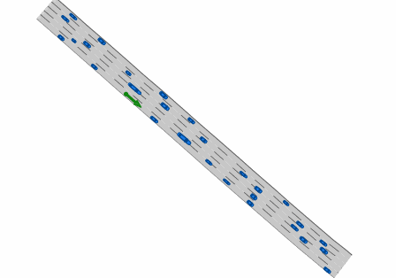

# Highway Driving [Final '24]

This exercise is the final graded exercise issued for the Fall semester of 2024.

## Problem description
Your task is to implement a planning (and control) stack for an autonomous vehicle, so that it can navigate safely and efficiently on highways with mixed traffic(i.e. you are surrounded by human drivers).

Specifically, given a desired lane, your planning stack needs to perform the lane changing maneuver without colliding with other road users. 
Note that, just like driving in real life, you can sense the current states of other vehicles, but you do **not** know what the exact action or policy others plan to take. Nonetheless, it is safe to assume that others obey the social conventions just as you do. For example, they will not intentionally crash on you and will try their best to avoid collisions.

An example of the highway scenarios is shown as follows. You will drive one of the vehicle and help it to change the lane.



To test your agent, you are provided with a simulator able to perform closed loop simulations.
The simulator at each time step provides observations to the agent, and it expects commands in return.


#### Simulation loop
Take a moment to check out the agent interface in the `exercises/ex12/agent.py` file.

At the beginning of the simulation, the method `on_episode_init` is called.
This provides valuable "static" information to the agent (e.g., agent's name, map, the desired lane). 

The simulation then enters a loop, where at each time step the simulator calls the method `get_commands`.
The method `get_commands` receives the latest "sensed" observations by the agent and is expected to return control commands.

The observations are computed assuming a 2D Lidar sensor with 360 fields of view. 
This means that they contain information only about the non-occluded players, see the image below for clarification.
Given obstacles shown in black, vehicles in the gray area would not be visible to the agent:


The observations included the states and the occupancies of the visible vehicles. The perceived states are noiseless.

The *simulation terminates* upon one of the following cases:
- An agent crashes into another vehicle or the road boundry;
- The maximum simulation time is reached.

### Vehicle model
The vehicle is modeled via a kinematic bicycle model (see [here](https://github.com/idsc-frazzoli/dg-commons/blob/master/src/dg_commons/sim/models/vehicle.py#L197) the dynamics equation).

The specific `VehicleState`, `VehicleCommands`, `VehicleGeometry`, and `VehicleParameters` of the vehicle are implemented according to the [dg-commons](https://github.com/idsc-frazzoli/dg-commons) library.
We suggest to get familiar with the required basic structures by navigating the code. 

Note that the simulator will enforce the following constraints:
- **Actuation limits**: The acceleration limits can be found in the `VehicleParameters` object.
- **State constraints**: The speed and steering limits of the vehicle can be found in the `VehicleParameters` object.

If the actuation limits are violated, the simulator will clip the actuation to the limits.
If state constraints are violated, the simulator will set the commands to zero (unless they help to return within the physical constraints).

### Map Structure
Your planning stack will be tested with real traffic scenarios from the [commonroad](https://commonroad.in.tum.de/) dataset. Please have a look at the definition and supported methods of the [lanelet](https://cps.pages.gitlab.lrz.de/commonroad/commonroad-io/api/scenario.html#commonroad.scenario.lanelet.Lanelet) and the [lanelet network](https://cps.pages.gitlab.lrz.de/commonroad/commonroad-io/api/scenario.html#laneletnetwork-class). 

Your agent can access the current lanelet network from the input of `on_episode_init` with `init_sim_obs.dg_scenario.lanelet_network`. You might use the method `lanelet_network.find_lanelet_by_position` to locate the agent on the lanelet network, and extract a specific lanelet with method `lanelet_network.find_lanelet_by_id`. 

For all test cases, you are safe to assume the lane width is constant and the road is approximately straight.

You can also access the goal lane from the imput of `on_episode_init` with `init_sim_obs.goal.ref_lane`. You can either access the lane centerline and the lane width from `init_sim_obs.goal.ref_lane.control_points` or find the corresponding CommonRoad lanelet with `lanelet_id = lanelet_network.find_lanelet_by_position([control_points[1].q.p])[0][0]`. 

Please note that, although different [goal types](src/dg_commons/sim/goals.py) are supported by the simulator, we make sure the goal type is `RefLaneGoal` in all test cases. The `goal_progress` specified in `RefGoalLane` is irrelevant to this exercise. 

### Test cases and performance criteria
Your task is to implement the agent in the `exercises/ex12/agent.py` file.

Your solution will then be used to control the ego vehicle in different maps with different initial states and goal lanes. All other vehicles are controlled by an **unknown** policy that can **react** to your action(i.e. they will brake if you cut-in, but you don't know when they will brake and how hard it will be). 

We evaluate your planning stack in three groups of scenarios:
- **basic scenarios**: There are at most 4 neighboring vehicles. The free space is enough to perform the lane changing. The performance of your algorithm on this type of scenarios contributes to 40% of the final points.

- **dense scenarios**: There is a flow of traffic on the goal lane. You need to find the right timing to change the lane efficiently and safely. The performance of your algorithm on this type of scenarios contributes to 50% of the final points.

- **challenging scenarios**: You almost missed a highway exit. As a remedial action, you want to merge in to the queue of exiting vehicles. Whether or not the merge is successful depends on the **reaction** of the other vehicles. Before you commit to a merging maneuver, make sure the rear vehicle will brake enough to avoid the collision. The performance of your algorithm on this type of scenarios contributes to 20% of the final points(you get the additional 10% as the bonus).

Once you run a simulation a report containing the performance metrics and a visualisation of the episode (make sure to click on the _data_nodes_ tab to see the animations) is generated.

Performance criteria involve(ordered by priority):
- **1.Collision Rate**: The vehicle should not crash into any vehicle or road boundary;
- **2.Success Rate**: The vehicle should reach the goal lane(we only evaluate the lateral position, but not the progress along the lane); 
- **3.1 Risk**: The vehicle should not be threatening to other road users. This is evaluated by the minimum time-to-collision of your trajectory. The time-to-collison is defined as the minimum time for you to collide with any other vehicles, if both of you keep the current velocity. Exact shape of the vehicles are used for computation.
- **3.2 Lane Changing Time**: The vehicle should reach the goal lane as soon as possible.
- **4.1 Compliance to the Lane Structure**: The vehicle heading should not deviate too much from the lane direction;
- **4.2 Compliance to the speed limit**: The vehicle should not drive too fast or too slow on the highway;
- **4.3 Discomfort**: The trajectory should be comfortable. This is measured by the root of mean square of the acceleration(frequency-weighted according to ISO 2631);
- **4.4 Computation**: The vehicle should on average take as little as possible to compute new commands.

You can find a precise definition of the performance criteria in `exercises_def/ex12/perf_metrics.py`.
In particular the `def __post_init__(self)` method of class `PlayerMetrics` defines how the metrics contribute to the final score.

## Run the exercise
<!-- Update your repository running `make update` (refer to [Hello World](01-helloworld.md) for more instructions). -->

<!-- Make sure to **rebuild the container** running the VS Code command (click Ctrl+Shift+P) `Remote-Containers: Rebuild Container` or `Remote-Containers: Rebuild and Reopen in Container`, and then reinstall the *pdm4ar* module running `pip3 install -e [path/to/exercises_repo]` in the VS Code terminal. -->

Run the exercise with:
```shell
python3 [path/to/]src/pdm4ar/main.py --exercise 12
```
or:
```shell
python3 [path/to/]src/pdm4ar/main.py -e 12
```


### Suggestions

**Planning vs Control rate**
The simulator performs steps at 10 _Hz_. 
While the agent is expected to provide commands every 0.1 _s_, the (re-)planning rate can probably be lower.
Consider decoupling the planning and control rate for better performance overall.

**Early development**: 
Note that running your agent in closed loop might be not the best way to build early prototypes.
Adding custom visualisation might be tedious and creating the animation might take some seconds every time.
We suggest developing and test first your agent's planning on a specific snapshot of the environment.

An example of how to visualise the initial configuration is provided in `exercise_def/ex12/sim_context.py`.

**Test on different instances**:
To avoid hard-coded solutions we will test your submissions on different instances of the environment.
You can make sure that your solution can deal with different instances of the world by changing the parameters in the config files or by creating new ones in the folder `exercises_def/ex12/*`.
If you create new configs, make sure to add them to the `exercises_def/ex12/ex12.py` file in the `get_exercise12` method.

**Test faster**:
To speed up the testing you can reduce the animation resolution by modifying the `dt` and the `dpi` parameters in `exercise_def/ex12/ex12.py`.
