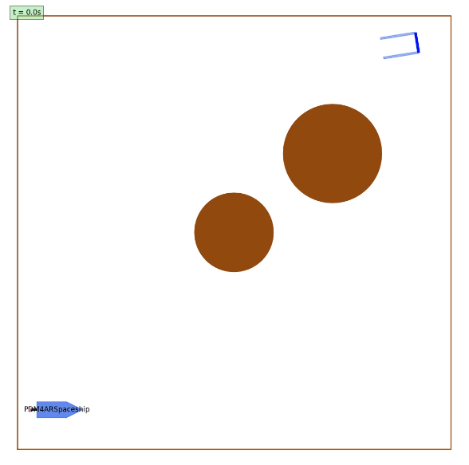
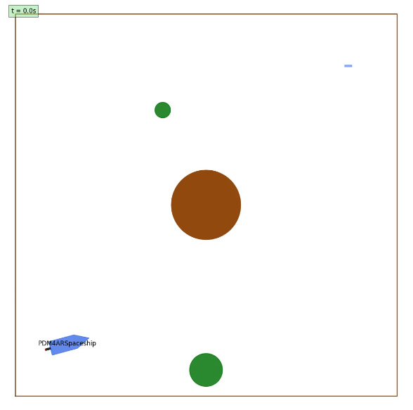
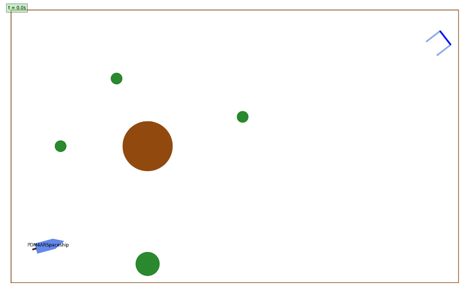
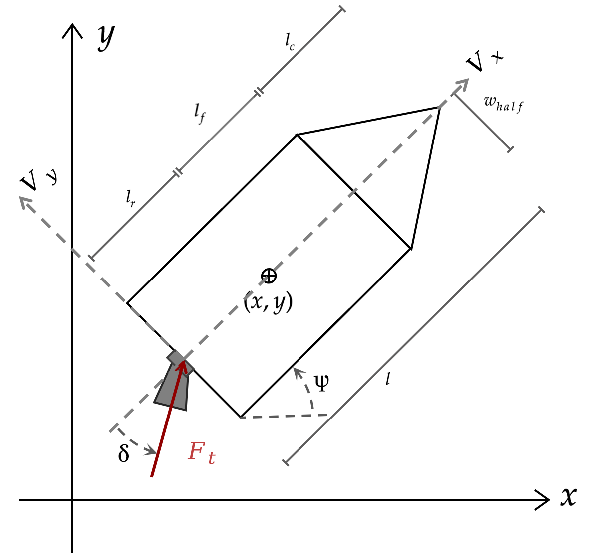
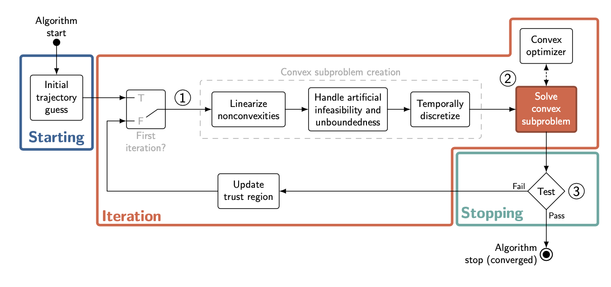

# PDM4AR Spaceship

This exercise tackles a complex problem in space exploration - navigating and docking a spaceship through challenging space environments.
The goal is to reach the predefined target location using the available thruster of the spaceship, which force and direction can be controlled.

## Task

Your task is to write the planning stack for the agent.
For testing and evaluation, the agent is then coupled with a simulator in closed-loop.
At each simulation step, the agent receives observations (about its state and other obstacles' state) and it is expected
to return actuation commands.

<!-- TODO change the image -->

Irrespective of the approach you choose, make sure to preserve the existing `Agent` interface (or it won't work with the
simulator).

You have the freedom to experiment and implement any planning algorithm you deem appropriate.
However, we provide a template to solve the problem adopting a sequential convexification approach.

## Scenarios

Your agent will be tested in three different scenarios:

1. **Scenario 1: Dodging Planets with a Docking Goal**
    - In this scenario, the spaceship needs to avoid planets while trying to arrive at a fixed final goal, $X_1$. 

   

2. **Scenario 2: Dodging a Planet and Its Satellites with a Static Goal**
    - The spaceship must navigate around a planet with multiple moving satellites to reach a certain goal position, $X_1$.

   

3. **Scenario 3: Dodging a Planet and Its Satellites with a Docking Goal**
    - Similar to Scenario 2, but the final goal is to dock like in Scenario 1.

   

## Spaceship dynamics
The spaceship's dynamics are represented by the following equations. 
Note that the pose is expressed in global frame, while the velocities are expressed in the spaceship frame.

1. **Position Dynamics:**
    - $\frac{dx}{dt} = v_x \cos(\psi) - v_y \sin(\psi)$
    - $\frac{dy}{dt} = v_x \sin (\psi) + v_y \cos(\psi)$

2. **Orientation Dynamics:**
    - $\frac{d\psi}{dt} = \dot{\psi}$

3. **Fuel Dynamics:**
    - $\frac{dm}{dt} = -C_T * F_{thrust}$

4. **Velocity Dynamics:**
    - $\frac{dv_x}{dt} = \frac{1}{m} \cos(\delta)F_{thrust} + \dot{\psi} v_y$
    - $\frac{dv_y}{dt} = \frac{1}{m} \sin(\delta)F_{thrust} - \dot{\psi} v_x$

5. **Angular Velocity Dynamics:**
    - $\frac{d\dot{\psi}}{dt} = - \frac{l_r}{I}\sin(\delta)F_{thrust}$
    - $\frac{d\dot{\delta}}{dt} = v_{\delta}$

If the spaceship's state is represented by $X = [x, y, \psi, v_x, v_y, \dot{\psi}, \delta, m]'$, and the control inputs 
are $U = [F_{thrust}, \dot{\delta}]$, we obtain the following dynamics equations:

6. **Dynamics:**
    - $\frac{dX(t)}{dt} = f(X(t), U(t))$

The spaceship you have the control over has one central thruster where you are able to control the amount of thrust to
produce $F_{thrust}$ and the angle of the thruster with respect to the spaceship $\delta$. The thruster is mounted centrally on the spaceship
with an offset of $l_r$ to the CoG of the spaceship. The velocity $v_x$ and $v_y$ are the velocities in the x and y
direction of the spaceship frame respectively. The angle $\psi$ is the angle of the spaceship with respect to the x-axis. The length of the spaceship is $l$.

## Constraints

There are several constraints that need to be satisfied, [$x_0, y_0$] is the starting location and [$x_1, y_1$] is the goal location:

- The initial and final inputs needs to be zero: $U(t_0) = U(t_f) = 0$
- The spaceship needs to arrive close to the goal
    - $\left\lVert \begin{bmatrix} x(t_f) \\ y(t_f) \end{bmatrix} - \begin{bmatrix} x_{\text{1}} \\ y_{\text{1}}
      \end{bmatrix} \right\rVert _{2} < \text{pos\_tol}$
- with a specified orientation.
    - $\left\lVert \psi(t_f) - \psi_{\text{1}} \right\rVert _{1} < \text{dir\_tol}$
- The spaceship needs to arrive with a specified velocity.
    - $\left\lVert \begin{bmatrix} v_x(t_f) \\ v_y(t_f) \end{bmatrix} - \begin{bmatrix} v_{x,1} \\ v_{y,1}
      \end{bmatrix} \right\rVert _{2} < \text{vel\_tol}$
- The spaceship needs to dodge every obstacle in its path: $(x, y) \bigoplus \mathcal{X}_{Rocket}(\psi) \notin Obstacle
  \quad \forall Obstacle \in Obstacles$
- The spaceship's mass should be greater than or equal to the mass of the spaceship without fuel: $m(t) \geq m_
  {spaceship} \quad \forall t$
- Control inputs, $F_{thrust}$ is limited: $F_{thrust} \in [-F_{\text{max}}, F_{\text{max}}]$.
- The thrust angle is limited: $\delta
  \in [-\delta_{\text{max}}, \delta_{\text{max}}]$.
- You have a maximum time to reach the goal position: $t_f \leq t_f^{max}$
- The rate of change of $\delta$ is limited: $v_{\delta} \in [-v^{max}_{\delta} ,v^{max}_{\delta}]$

## Evaluation Metrics

The quality of the spaceship's trajectory is evaluated based on several key factors:

0. **Mission Accomplishment** You safely reach the goal region.

1. **Planning Efficiency:** We consider the average time spent in the "get_commands" method as a proxy for efficiency
   and quality of the planner.

2. **Time Taken To Reach the Goal:** The time taken to reach the goal.

3. **Mass Consumption:** The amount of fuel used to reach the final goal.

You can verify more precisely the function computing the final score in  `src/pdm4ar/exercises_def/ex11/perf_metrics.py`

## Data  Structures

The various data structures needed for the development of the exercise can be inspected in the following files:

- SpaceshipState & SpaceshipCommands: `dg_commons/sim/models/spaceship.py`
- SpaceshipGeometry & SpaceshipParameters: `dg_commons/sim/models/spaceship_structure.py`
- SatelliteParams & PlanetParams: `src/pdm4ar/exercises_def/ex11/utils_params.py`

## Code Structure

The various data structures needed for the development of the exercise can be inspected in the following files:

- **agent.py**: Interface with the simulator.
- **planner.py**: SCvx skeleton.
- **spaceship.py**: Helper file for transfer of dynamics between the planner and discretization.
- **discretization.py**: ZeroOrderHold and FirstOrderHold Implementation for convexification.

## Hints

We developed the exercises based on the following
paper ([Convex Optimisation for Trajectory Generation](https://arxiv.org/pdf/2106.09125.pdf)) on SCvx, the planning
method used in 2021 by SpaceX to land their spaceship on a moving platform in the middle of the ocean. We recommend to use
such a method to solve the problem, but you are free to come up with your own solution. We made available some basic
skeleton structure to implement the SCvx pipeline in the **planner.py**. The **discretization.py** file provides an
implementation of the ZeroOrderHold and FirstOrderHold that is used in the convexification step of the SCvx pipeline to
linearize and discretize around a reference
trajectory ([Discretization Performance and Accuracy Analysis for the Powered Descent Guidance Problem](https://www.researchgate.net/publication/330200259_Discretization_Performance_and_Accuracy_Analysis_for_the_Rocket_Powered_Descent_Guidance_Problem)
and [A Real-Time Algorithm  for Non-Convex Powered Descent Guidance](https://depts.washington.edu/uwrainlab/wordpress/wp-content/uploads/2020/01/AIAA_SciTech_2020.pdf)).

### SCvx

If you decide to go with the SCvx implementation here is an overview of the general algorithm:

- compute initial guess for state and input sequences
- begin loop: 
    - convexification step: compute discretization step of the linear dynamics around the current guess and populate problem parameters depending on the current guess
    - solve optimization problem
    - check convergence of the solution: if converged, exit loop otherwise, update trust region according to the paper
- extract solutions to return valid commands and trajectory.

We strongly suggest to read at least the page 26 to 37 to understand the whole setting of SCvx.
We also recommand to read the previous 25 pages for better understanding of the underlying concepts of SPC algorithms (especially figure 11). You will also find an example of a theoritical application pages 47 to 52. 
We might have forgotten to mention important pages, we thus strongly encourage you to explore the rest of the paper by yourself.

<!-- In the paper "A Real-Time Algorithm for Non-Convex Powered Descent Guidance" (https://depts.washington.edu/uwrainlab/wordpress/wp-content/uploads/2020/01/AIAA_SciTech_2020.pdf), you will find the use of \textit{Scaling Matrices} to scale states, inputs and parameters to produce numerically well-conditioned optimization problems. Our solution implementation only made use of scaling the parameters, not touching on states and inputs, and converged reliably. We recommend to use the same approach and  only introducing the normalization of states and inputs if you are facing numerical issues. -->

In addition, the docker goal class has a method to return notable points (get_landing_constraint_points). Try to think how you can use them to create a valid constraints. (We suggest to activate the landing constraints only on the final [5-7] steps).

As a general and final advice try to understand the method **before** starting to code.

## Available Optimization Tools

If your solution needs to solve an optimization problem, we have added powerful libraries in the container to solve
optimization problems. For instance, `scipy.optimize`, PuLP, cvxpy and cvxopt. We tested cvxpy with "ECOS" and "MOSEK" as
solvers for our SCvx pipeline. If you want to use other optimizers, or you are not using SCvx to solve the problem,
**please consider that we have not tested it**.

