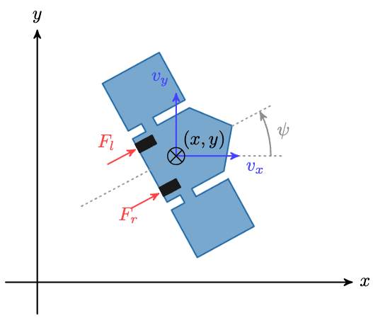
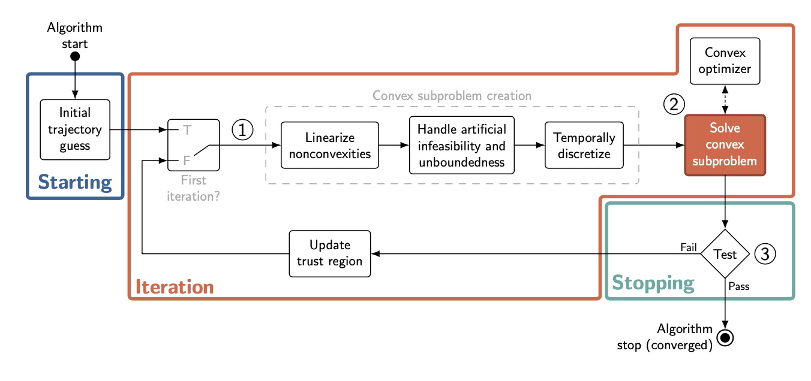

# PDM4AR Satellite Docking

This exercise tackles a complex problem in space exploration - navigating and docking a satellite through challenging space environments.
The goal is to reach the predefined target location using the available thrusters of the satellite, which force can be controlled.

## Task

Your task is to write the planning stack for the agent.
For testing and evaluation, the agent is then coupled with a simulator in closed-loop.
At each simulation step, the agent receives observations (about its state and other obstacles' state) and it is expected
to return actuation commands.

<!-- TODO change the image -->

Irrespective of the approach you choose, make sure to preserve the existing `Agent` interface (or it won't work with the
simulator).

You have the freedom to experiment and implement any planning algorithm you deem appropriate.
However, we provide a template to solve the problem adopting a sequential convexification approach.

## Scenarios

Your agent will be tested in three different scenarios:

1. **Scenario 1: Dodging Planets with a Target Goal**
    - In this scenario, the satellite needs to avoid one or multiple planets while trying to arrive at a fixed final goal, $X_1$. 

   

2. **Scenario 2: Dodging Planets with a Docking Goal**
    - The satellite must navigate around one or multiple planets while successfully docking at the target $X_1$.

   

3. **Scenario 3: Dodging Planets and the asteroid field with a Docking Goal**
    - Similar to Scenario 2, but with moving obstacles. Here the moving osbtacles are asteroids with linear trajectories.

   

In `exercises_def>ex13` you can find also a `config_local.yaml` file with a couple instructions to create your own local test files, moving around the starting point or the goal, planets or asteroids, changing their dimensions or velocity. To choose which test cases to run, you have to modify the `get_config.py` file in the same folder.

## Spaceship dynamics
The spaceship's dynamics are represented by the following equations. 
Note that the pose and velocities are expressed in global frame.

1. **Position Dynamics:**
    - $\frac{dx}{dt} = v_x$
    - $\frac{dy}{dt} = v_x$

2. **Orientation Dynamics:**
    - $\frac{d\psi}{dt} = \dot{\psi}$

3. **Velocity Dynamics:**
    - $\frac{dv_x}{dt} = \frac{1}{m} \cos(\psi) \cdot (F_{r} + F_{l})$
    - $\frac{dv_y}{dt} = \frac{1}{m} \sin(\psi) \cdot (F_{r} + F_{l})$
4. **Angular Velocity Dynamics:**
    - $\frac{d\dot{\psi}}{dt} = \frac{l_m}{I} \cdot (F_{r} + F_{l})$

If the spaceship's state is represented by $X = [x, y, \psi, v_x, v_y, \dot{\psi}]$, and the control inputs 
are $U = [F_{r}, F_{l}]$, we obtain the following dynamics equations:

1. **Dynamics:**
    - $\frac{dX(t)}{dt} = f(X(t), U(t))$

The satellite you have the control over has two side thrusters where you are able to individually control the amount of thrust to
produce $F_{r}$ and $F_{l}$. The thrusters are mounted on the side of the satellite. The velocity $v_x$ and $v_y$ are the velocities in the x and y axis direction of the satellite with respect to the world frame x-axis and y-axis. The angle $\psi$ is the angle of the satellite with respect to the x-axis. The length of the spaceship is $l$.

You may check your implementation of the dynamics in the init function in `planner.py`, right after the creation of the integrator object.

The two following figures illustrate the geometrical parameters as well as the state and input.

## Constraints

There are several constraints that need to be satisfied, [$x_0, y_0$] is the starting location and [$x_1, y_1$] is the goal location:

- The initial and final inputs needs to be zero: $U(t_0) = U(t_f) = 0$
- The satellite needs to arrive close to the goal
    - $\left\lVert \begin{bmatrix} x(t_f) \\ y(t_f) \end{bmatrix} - \begin{bmatrix} x_{\text{1}} \\ y_{\text{1}}
      \end{bmatrix} \right\rVert _{2} < \text{pos\_tol}$
- with a specified orientation.
    - $\left\lVert \psi(t_f) - \psi_{\text{1}} \right\rVert _{1} < \text{dir\_tol}$
- The satellite needs to arrive with a specified velocity.
    - $\left\lVert \begin{bmatrix} v_x(t_f) \\ v_y(t_f) \end{bmatrix} - \begin{bmatrix} v_{x,1} \\ v_{y,1}
      \end{bmatrix} \right\rVert _{2} < \text{vel\_tol}$
- The satellite needs to dodge every obstacle in its path: $(x, y) \bigoplus \mathcal{X}_{Rocket}(\psi) \notin Obstacle
  \quad \forall Obstacle \in Obstacles$
- Control inputs, $F_{l}$ and $F_{r}$ are limited: $F_{l}$ and $F_{r} \in [-F_{\text{max}}, F_{\text{max}}]$.
- You have a maximum time to reach the goal position: $t_f \leq t_f^{max}$

## Evaluation Metrics

The quality of the satellite's trajectory is evaluated based on several key factors. The following list describes the metrics in order of priorities:

1.1. **No Collision** You neither leave the designated boundary nor collide with any obstacle.

1.2. **Mission Accomplishment** You reach the goal region.

2.1. **Time Taken To Reach the Goal:** The time taken to reach the goal.

2.2. **Distance travelled:** The length of the taken trajectory.

2.3. **Actuation effort:** The average of the absolute value of the thrusters' force.

2.4. **The precision of the planner:** Distance to the goal at the end of the episode.

2.5. **Planning Efficiency:** We consider the average time spent in the "get_commands" method as a proxy for efficiency
   and quality of the planner.

The metric is a weigthed sum of the different metrics mentionned above with 1000 being the maximum. Note that it is theoretically impossible to reach full score as we penalise computation time and actualtion effort which are by definition none zero if the mission is accomplished (but can be optimized). You can verify more precisely the function computing the final score in  `src/pdm4ar/exercises_def/ex13/perf_metrics.py`.

As a reference, the TA solution receives the following score on the private test cases:

| Scenario            | Score       |
|---------------------|-------------|
| Average             |     873.53  |
| Scenario 1          |     891.98  |
| Scenario 2          |     874.90  |
| Scenario 3          |     853.70  |

Use these numbers as a guideline to understand the order of magnitude of expected performance for a descently optimized solution.

## Data  Structures

The various data structures needed for the development of the exercise can be inspected in the following files:

- SatelliteState & SatelliteCommands: `dg_commons/sim/models/satellite.py`
- SatelliteGeometry & SatelliteParameters: `dg_commons/sim/models/satellite_structure.py`
- AsteroidParams & PlanetParams: `src/pdm4ar/exercises_def/ex13/utils_params.py`

## Code Structure

The various data structures needed for the development of the exercise can be inspected in the following files:

- **agent.py**: Interface with the simulator.
- **planner.py**: SCvx skeleton.
- **satellite.py**: Helper file for transfer of dynamics between the planner and discretization.
- **discretization.py**: ZeroOrderHold and FirstOrderHold Implementation for convexification. Note that here you are not required to modify anything, but you still have to understand what the functions do for the completion of the algorithm.

## Hints

We developed the exercises based on the following
paper ([Convex Optimisation for Trajectory Generation](https://arxiv.org/pdf/2106.09125.pdf)) on SCvx, the planning
method used in 2021 by SpaceX to land their spaceship on a moving platform in the middle of the ocean. We recommend to use
such a method to solve the problem, but you are free to come up with your own solution. We made available some basic
skeleton structure to implement the SCvx pipeline in the **planner.py**. The **discretization.py** file provides an
implementation of the ZeroOrderHold and FirstOrderHold that is used in the convexification step of the SCvx pipeline to
linearize and discretize around a reference
trajectory ([Discretization Performance and Accuracy Analysis for the Powered Descent Guidance Problem](https://www.researchgate.net/publication/330200259_Discretization_Performance_and_Accuracy_Analysis_for_the_Rocket_Powered_Descent_Guidance_Problem)
and [A Real-Time Algorithm  for Non-Convex Powered Descent Guidance](https://depts.washington.edu/uwrainlab/wordpress/wp-content/uploads/2020/01/AIAA_SciTech_2020.pdf)).

### SCvx

If you decide to go with the SCvx implementation here is an overview of the general algorithm:

- compute initial guess for state and input sequences
- begin loop: 
    - convexification step: compute discretization step of the linear dynamics around the current guess and populate problem parameters depending on the current guess
    - solve optimization problem
    - check convergence of the solution: if converged, exit loop otherwise, update trust region according to the paper
- extract solutions to return valid commands and trajectory.

We strongly suggest to read at least the pages 26 to 37 to understand the whole setting of SCvx.
We also recommand to read the previous 25 pages for better understanding of the underlying concepts of SPC algorithms (especially figure 11). You will also find an example of a theoritical application pages 47 to 52. 
We might have forgotten to mention important pages, we thus strongly encourage you to explore the rest of the paper by yourself.

<!-- In the paper "A Real-Time Algorithm for Non-Convex Powered Descent Guidance" (https://depts.washington.edu/uwrainlab/wordpress/wp-content/uploads/2020/01/AIAA_SciTech_2020.pdf), you will find the use of \textit{Scaling Matrices} to scale states, inputs and parameters to produce numerically well-conditioned optimization problems. Our solution implementation only made use of scaling the parameters, not touching on states and inputs, and converged reliably. We recommend to use the same approach and  only introducing the normalization of states and inputs if you are facing numerical issues. -->

### Docking targets and landing constraints

In addition, the docker goal class has a method to return notable points (get_landing_constraint_points). Try to think how you can use them to create a valid constraints. (We suggest to activate the landing constraints only on the final [5-7] steps). You can visualize a representation of the docking goal as an image in the out folder to get a better idea of which points are returned:

As a general and final advice try to understand the method **before** starting to code.

### Plotting function

To help you get started debugging the exercise, we’ve included a simple plotting helper, `plot_traj`, in `src/pdm4ar/axercises_def/ex13/utils_plot.py`. It’s an example of a plot that can be useful during debugging; feel free to extend it or design your own visualizations. We strongly encourage you to plot whatever you need to better understand your code’s behavior and pinpoint issues. The plotting feature can be enabled and disabled in the config class present in `agent.py`. The figure below shows an exmple where the trajectory has been followed pefectly. The black arrows and continuous lines represent the computed heading of the satellite and its trajectory. The red arrows and dotted line represent the simulated heading and trajectory. The image refreshes during simulation enabaling you to visualise the simulation while it is happening and don't need to wait for the videos to be created. This is particulary useful when running multiple configs at once. The refresh rate of the image can be changed in the `get_command()` in the angent class.

## Dynamics check

To help you validate your dynamics model, we have implemented a function that simulates the agent using your dynamics on a prerecorded set of inputs and compares the results against the ground truth. This verification is automatically performed in the planner’s constructor. We strongly recommend ensuring that your implementation passes this dynamics check before proceeding with the rest of your solution. Note that this function is provided solely as a debugging tool and will not be used in the final evaluation.

## Available Optimization Tools

If your solution needs to solve an optimization problem, we have added powerful libraries in the container to solve
optimization problems. For instance, `scipy.optimize`, PuLP, cvxpy and cvxopt. We tested cvxpy with "ECOS" and "CLARABEL" as
solvers for our SCvx pipeline. If you want to use other optimizers, or you are not using SCvx to solve the problem,
**please consider that we have not tested it**.

Moreover, we suggest looking into DCP and DPP systems. DCP stands for [Disciplined Convex Programming](https://www.cvxpy.org/tutorial/dcp/index.html), while DPP stands for [Disciplined Parametrized Programming](https://www.cvxpy.org/tutorial/dpp/index.html). Both are rulesets you should follow to build a convex problem (DCP) that is also fast and efficient to solve repeatedly with different parameters (DPP), as in your case.