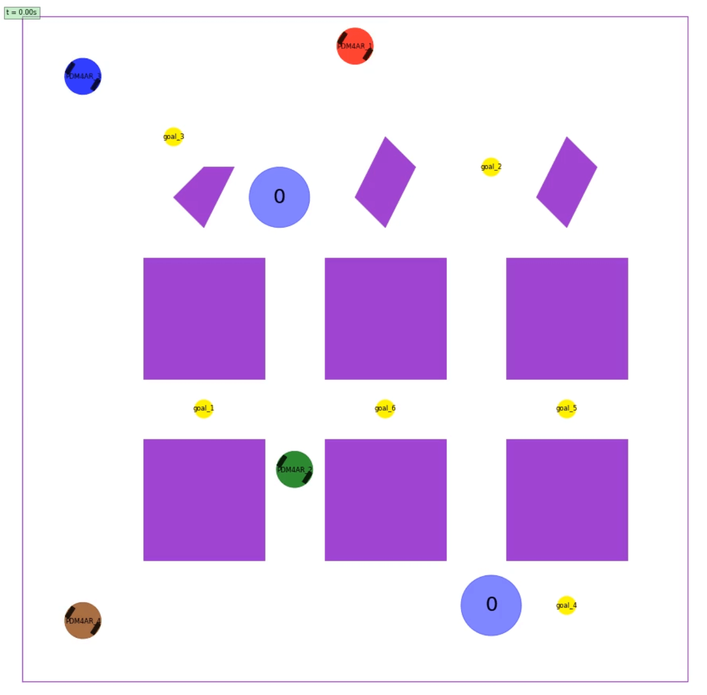
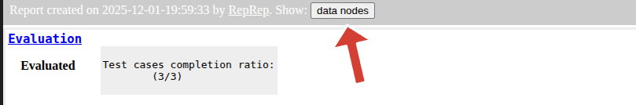

# Multi-agent Goal Collection [Final '25]

## Problem description
Your task is to implement a planning and control system for a fleet of differential drive robots. The robots must autonomously navigate a warehouse environment to collect goals and deliver them to designated collection points. Robots automatically pick up a goal when they reach a close proximity and deposit it upon entering the collection area. Each robot has a maximum capacity of **ONE** goal at a time.

To test your agent, you are provided with a simulation environment. The environment provides observations to each agent at each time step and expects control commands in return. Additionally, an one-time global planning phase occurs before the simulation starts, allowing you to coordinate all agents to maximize overall efficiency.

See below an image of the environment:




## Task Overview

You can find all `TODOs` for this exercise in `src/pdm4ar/exercises/ex14/agent.py`. Feel free to add addition files under `src/pdm4ar/exercises/ex14/` if needed. We will replace the entire `ex14` folder with your submission when evaluating on the server.

### 1. One-time Global Planning

To develop your own global planner, implement the `Pdm4arGlobalPlanner.send_plan(...)` method. The method receives an `InitSimGlobalObservations` object and generates a serialized global plan in `str` type, which will be broadcasted to all agents. You can encode any information you want into this global plan.

Every agent exposes an `Pdm4arAgent.on_receive_global_plan(...)` callback which is called when the global plan is received. You can use this callback to parse the received global plan and initialize your agent's internal states.

To help to define and serialize/deserialize structured message (i.e., the global plan), we provide an example using `Pydantic` in the template code. You can choose to use this method or any other methods you prefer (e.g., JSON, pure string, etc.).

#### Note:
`Pdm4arAgent.on_receive_global_plan(...)` is called **only once** at the beginning of the simulation, after `Pdm4arAgent.on_episode_init(...)` is called for each agent but before the first call to `Pdm4arAgent.get_commands(...)`.

#### Available Data Structures:

Under `dg_commons/sim/`:

`simulator_structures.py::InitSimGlobalObservations` contains the following information:
- Initial positions of all robots
- Locations of all goals (as `shared_goals.py::SharedPolygonGoal` objects)
- Locations of all collection points (as `shared_goals.py::CollectionPoint` objects)
- All map information (boundaries and static obstacles)

`src/pdm4ar/exercises/ex14/agent.py::GlobalPlanMessage` is an example `Pydantic` model for defining a structured global plan message. You can modify it or create your own structure as needed.

### 2. Agent Control
After the global planning phase, the simulation starts. Each robot is controlled by an instance of a `Pdm4arAgent` which inherits from the base class `Agent`. You must implement your agent by:

1. **Overriding `on_episode_init(init_obs: InitSimObservations)`**: This method is called once at the beginning of the simulation for each agent. The `InitSimObservations` object contains:
   - `my_name`: The agent's unique player name
   - `seed`: Random seed for reproducibility
   - `dg_scenario`: The scenario information (boundaries, static obstacles)
   - `goal`: The agent's individual goal (NOT used in this exercise)
   - `model_geometry`: The robot's geometry (`DiffDriveGeometry`)
   - `model_params`: The robot's dynamic parameters (`DiffDriveParameters`)

2. **Overriding `on_receive_global_plan(serialized_msg: str)`**: This method receives the string returned by the global planner's `send_plan(...)` method. You can deserialize it here and store the information for use during execution.

3. **Overriding `get_commands(sim_obs: SimObservations) -> DiffDriveCommands`**: This method is called every `dt_commands` seconds (0.1s by default) and must return control commands. The `SimObservations` object contains:
   - `players`: A mapping of player names to `PlayerObservations` objects, which contain:
     - `state`: The player's current state (e.g., `DiffDriveState`)
     - `occupancy`: The player's footprint polygon
     - `collected_goal_id`: The ID of the goal currently being carried by this player (if any)
   - `time`: The current simulation time
   - `available_goals`: A mapping of goal IDs to `SharedGoalObservation` objects (only includes goals not yet collected), each containing:
     - `occupancy`: The goal's polygon footprint

:warning: Only players and available goals within the sensor range and line-of-sight are included in `SimObservations` (see [Observations and Sensors](#obs-sensor) below for details).

#### Simulation loop
At the beginning of the simulation, the method `on_episode_init` is called for each agent.

The simulation then enters a loop, where at each timestep the simulator calls the `get_commands` method of each agent.
The method `get_commands` receives the latest "sensed" observations and is expected to return control commands.


#### Observations and Sensors
{:#obs-sensor}
The observations are computed assuming a 2D Lidar sensor with 360-degree field of view and a detection range of **5 meters**. This means they contain information only about non-occluded players and goals. The sensor is implemented using the `FovObsFilter` class, which filters the full observations based on line-of-sight.

Another robot or goal in the gray (occluded) area would not be visible to the agent:


The available observations in `sim_obs.players` will only include robots within sensor range and line-of-sight. Similarly, `sim_obs.available_goals` will only include goals that are:
- Not yet collected by any agent
- Within sensor range and line-of-sight

**Important**: All static obstacles are known beforehand (available in `init_obs.dg_scenario.static_obstacles`), but other robots are dynamic obstacles that must be detected via the sensor.

### Rules and Mechanics

1. **No communication after global planning**: After the initial global planning phase, each robot operates independently based on its local observations and the pre-computed global plan. **No further communication or coordination between robots is allowed (No global variables, no shared memory, no inter-agent messaging, no file sharing, etc.).**

2. **Automatic goal collection**: When a robot that is not currently carrying a goal comes within range of a goal (i.e., the robot's position enters the goal's polygon), it automatically picks up that goal. This is handled by the `SharedPolygonGoalsManager` in the simulator.

3. **Automatic goal delivery**: When a robot carrying a goal enters a collection point's polygon, it automatically drops off the goal. This is also handled by the `SharedPolygonGoalsManager`.

4. **Single goal capacity**: Each robot can carry at most one goal at a time. To pick up another goal, it must first deliver its current goal to a collection point.

5. **Disable after collision**: If a robot collides with an obstacle (static or another robot), it is considered "disabled" and can no longer move or collect/deliver goals for the remainder of the simulation.

6. **Decentralized execution**: Each agent instance runs the same policy you design, acting only on local observations without direct communication.

### Termination Conditions
The *simulation terminates* upon one of the following cases:
- **Success**: All goals have been collected and delivered to collection points
- **Timeout**: The maximum simulation time (`max_sim_time`) is reached
- **All agents collided**: All robots have collided and are disabled

### Differential drive model
The robot is a differential drive robot modeled according to the one seen in `Lecture 4: Steering`.

The specific `DiffDriveState`, `DiffDriveCommands`, `DiffDriveGeometry`, and `DiffDriveParameters` of the robot are implemented according to the [dg-commons](https://github.com/idsc-frazzoli/dg-commons) library.
We suggest getting familiar with the required basic structures by navigating the code (usually "Ctrl+click" helps).

The robot's state (`DiffDriveState`) includes:
- `x`, `y`: Position coordinates
- `psi`: Heading angle

The control commands (`DiffDriveCommands`) specify:
- `omega_l`: Left wheel angular velocity in rad/s. Positive values indicate forward rotation.
- `omega_r`: Right wheel angular velocity in rad/s. Positive values indicate forward rotation.

Note that the simulator will enforce the following constraints:
- **Actuation limits**: The min/max rotational velocity of the wheels can be found in the `DiffDriveParameters` object.

If the actuation limits are violated, the simulator will simply clip the value to the limits. However, the actuation effort penalty will still be computed based on the original command values you provided. See [Performance Criteria and Scoring](#performance-criteria-and-scoring) below for details.

## Performance Criteria and Scoring
{:#performance-criteria-and-scoring}

Your solution will be evaluated based on multiple criteria. The performance metrics are defined in `exercises_def/ex14/perf_metrics.py`.

### Individual Player Metrics (`PlayerMetrics`)
For each player, the following metrics are tracked:
- **`collided`**: Whether the player crashed into an obstacle or another robot
- **`num_goal_delivered`**: Number of goals successfully delivered by this player
- **`travelled_distance`**: Total distance traveled by the player
- **`waiting_time`**: Total time elapsed before goals are delivered (sum of delivery times)
- **`actuation_effort`**: Integral of absolute wheel velocities
- **`avg_computation_time`**: Average time taken by the `get_commands` method

### Overall Metrics (`AllPlayerMetrics`)
The overall performance combines all players' metrics:
- **`num_collided_players`**: Total number of players that crashed
- **`num_goals_delivered`**: Total number of goals delivered by all players
- **`total_travelled_distance`**: Sum of distances traveled by all players
- **`max_sim_time`**: Maximum simulation time allowed
- **`task_accomplishment_time`**: Total time taken to deliver all goals (time when last goal was delivered)
- **`total_actuation_effort`**: Sum of actuation efforts of all players
- **`avg_computation_time`**: Average computation time across all players (per `get_commands` call)
- **`global_planning_time`**: Total time spent on global planning (execution time of `send_plan` method)

### Score Function
The final score is computed by the `reduce_to_score()` method in `AllPlayerMetrics`:

```python
score = num_goals_delivered * 100
score -= num_collided_players * 500
score += (max_sim_time - task_accomplishment_time) * 10
score -= total_travelled_distance * 0.5
score -= total_actuation_effort * 0.01
score -= max(0.0, avg_computation_time - 0.1) * 100
score -= max(0.0, global_planning_time - 60) * 10
```

**Key takeaways**:
- **Primary objective**: Maximize the number of goals delivered (100 points each)
- **Critical penalty**: Avoid collisions (500 point penalty per collision)
- **Early completion bonus**: Finish faster to earn bonus points (10 points per second saved)
- **Efficiency matters**:
  - Minimize travel distance (0.5 point penalty per unit distance - highest weight among efficiency metrics)
  - Minimize actuation effort (0.01 point penalty per unit effort)
- **Computation time budget**: Keep `get_commands` execution time under the control rate (0.1s). Penalty of 100 points per second over budget.
- **Global planning budget**: Keep global planning under 60 seconds (10 point penalty per second over budget). But sometimes spending more time here can be worth it if it leads to better overall performance.
- **Higher scores are better**

### Reference Scores
We provide the scores of the private test cases using our baseline implementation below for your reference:

| Test Case        | Reference Score |
| ---------------- | --------------- |
| config_1_private | 489.43          |
| config_2_private | 904.30          |
| config_3_private | 1255.45         |

## Test cases
The test cases on the server differ from the ones provided locally only by configuration parameters (number of robots, number of goals, map layout, etc.). Your solution should be general enough to handle different scenarios. But don't be worried, the topology of the environment will remain similar to the ones provided in the local tests.

### Generate new test cases
You can create new test cases by adding new configuration files in the `exercises_def/ex14/` folder and adding them to the list of available configurations in the `exercises_def/ex14/ex14.py` file.

:sparkles: We provide a script to generate random configurations for this exercise at `exercises_def/ex14/random_config.py`. Feel free to modify and use it to create new test cases for your own testing.

## Run the exercise

Run the exercise with:
```shell
python path/to/src/pdm4ar/main.py --exercise 14
```
or:
```shell
python path/to/src/pdm4ar/main.py -e 14
```

## View the report
Once you run a simulation, a report containing the performance metrics and a visualization of the episode is generated. Click the `data nodes` button in the top bar of the report to show the generated visualizations.



## Suggestions and Tips

**Planning vs Control rate**:
The simulator invokes the `get_commands` method at 10 Hz (every 0.1s). While the agent is expected to provide new commands every 0.1s, the (re-)planning rate can probably be lower. Consider decoupling the planning and control rate for better performance overall. For example, you might recompute paths every 0.5s but update control commands every 0.1s.

**Decentralized solutions and game theory**:
Note that every robot is running _"the same"_ agent that you designed. Try to leverage this to your advantage. To coordinate and plan in the proximity of other robots, you know that they would react exactly as you would. This can be used for implicit coordination without communication.

**Early development**:
Note that running your agent in closed loop might not be the best way to build early prototypes. Adding custom visualization might be tedious and creating the animation might take some seconds every time. We suggest developing and testing first your agent's planning on a specific snapshot of the environment.

**Test on different instances**:
To avoid hard-coded solutions, we will test your submissions on different instances of the environment. You can make sure that your solution can deal with different instances by changing the parameters in the config files or by creating new ones in the folder `exercises_def/ex14/*`. If you create new configs, make sure to add them to the `exercises_def/ex14/ex14.py` file in the appropriate method.

**Test faster**:
To speed up testing, you can reduce the animation resolution or disable visualization during development. Check the configuration parameters in `exercises_def/ex14/ex14.py`.

**Use the global planner wisely**:
The one-time global planning phase is powerful. Consider:
- Task allocation: Which robot should collect which goals? and in which order?
- Path planning: Pre-compute collision-free paths or waypoints
- Coordination: Design strategies to avoid deadlocks and conflicts

**Handle dynamic obstacles**:
While static obstacles are known in advance, other robots are dynamic obstacles. Your control policy in `get_commands` should:
- React to observed robots in real-time
- Use the global plan as a high-level guide
- Implement local collision avoidance

**Monitor goal availability**:
The `sim_obs.available_goals` dictionary only includes goals that haven't been collected yet. If a goal you were planning to collect disappears from this dictionary, it means another robot collected it first. Your agent should be able to adapt and select a different goal.

**Debug using observations**:
You can return extra information for visualization using the `on_get_extra()` method in your agent. This information can be visualized in the report.
